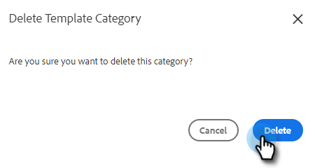

# Administrar categorías de plantilla {#manage-template-categories}

## Crear una categoría {#create-a-category}

1. Haga clic en la ficha **[!UICONTROL Plantillas]**.

   

1. Haga clic en el icono **+** junto a **[!UICONTROL Categorías]**.

   

1. Escriba un nombre para la nueva categoría y haga clic en **[!UICONTROL Crear]**.

   

## Cambiar nombre de categoría de plantilla {#rename-a-template-category}

1. Haga clic en la ficha **[!UICONTROL Plantillas]**.

   

1. Pase el ratón sobre la plantilla cuyo nombre quiera cambiar y haga clic en el punto (tres puntos). Seleccione **[!UICONTROL Cambiar nombre]**.

   

1. Escriba el nuevo nombre. Pulse Intro (o haga clic en cualquier otra parte de la pantalla) para guardar.

   

## Eliminar una categoría de plantilla {#delete-a-template-category}

1. Haga clic en la ficha **[!UICONTROL Plantillas]**.

   

1. Pase el ratón sobre la plantilla cuyo nombre quiera cambiar y haga clic en el punto (tres puntos). Seleccione **[!UICONTROL Eliminar]**.

   

1. Haga clic en **[!UICONTROL Eliminar]** para confirmar.

   

>[!NOTE]
>
>Las categorías no se pueden eliminar si contienen plantillas. Mueva o elimine todas las plantillas antes de eliminar una categoría.
