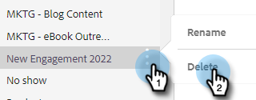

# Administrar categorías de plantilla {#manage-template-categories}

## Crear una categoría {#create-a-category}

1. Haga clic en el **Plantillas** pestaña .

   

1. Haga clic en el **+** junto a **Categorías**.

   

1. Escriba un nombre para la nueva categoría y haga clic en **Crear**.

   

## Cambiar el nombre de una categoría de plantilla {#rename-a-template-category}

1. Haga clic en el **Plantillas** pestaña .

   

1. Pase el ratón sobre la plantilla a la que quiera cambiar el nombre y haga clic en los datos (tres puntos). Select **Cambiar nombre**.

   

1. Escriba el nuevo nombre. Pulse Intro (o haga clic en cualquier otra parte de la pantalla) para guardar.

   

## Eliminar una categoría de plantilla {#delete-a-template-category}

1. Haga clic en el **Plantillas** pestaña .

   

1. Pase el ratón sobre la plantilla a la que quiera cambiar el nombre y haga clic en los datos (tres puntos). Select **Eliminar**.

   

1. Haga clic en **Eliminar** para confirmar.

   

>[!NOTE]
>
>Las categorías no se pueden eliminar si aún tienen plantillas en ellas. Mover o eliminar todas las plantillas antes de eliminar una categoría.
