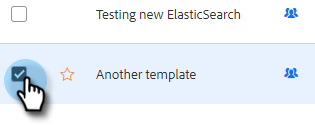

# Administrar plantillas {#manage-templates}

## Crear una plantilla {#create-a-new-template}

1. Vaya a **Plantillas** pestaña.

   

1. Clic **Crear plantilla**.

   

1. Elija una **Nombre** y **Categoría** para la plantilla de correo electrónico y haga clic en **Crear**.

   

1. En el editor de plantillas, cree una línea de asunto para el correo electrónico y escriba el mensaje deseado. Utilice las herramientas de edición (fuente, tamaño de texto, etc.) para personalizar el aspecto. Clic **Guardar** para finalizar los cambios.

   

>[!TIP]
>
>Escriba siempre texto directamente en la plantilla o cópielo desde un editor de texto sin formato (por ejemplo, Bloc de notas o TextEdit). Copiar y pegar desde un editor de texto enriquecido (por ejemplo, MS Word) puede causar irregularidades en el formato.

## Ver detalles de la plantilla {#view-template-details}

El área Detalles de plantilla contiene varias pestañas.

<table>
 <tr>
  <td><strong>Plantilla</strong></td>
  <td>Revise y realice ediciones, configure criterios para que la plantilla sea una plantilla recomendada y añada notas</td>
 </tr>
 <tr>
  <td><strong>Analytics</strong></td>
  <td>Revise los análisis de participación para la plantilla. Realice una búsqueda filtrada.</td>
 </tr>
 <tr>
  <td><strong>Emails</strong></td>
  <td>Ver todos los correos electrónicos enviados con esta plantilla. Realice una búsqueda filtrada.</td>
 </tr>
 <tr>
  <td><strong>Campañas</strong></td>
  <td>Ver en qué campañas se utiliza la plantilla.</td>
 </tr>
</table>

## Compartir una plantilla {#share-a-template}

Si utiliza una de las cuentas de equipo, todas las plantillas seguirán siendo privadas de forma predeterminada.

1. Vaya a **Plantillas** pestaña.

   

1. Busque y elija la plantilla que desee.

   

1. Haga clic en **Compartir** botón.

   

   >[!NOTE]
   >
   >Las plantillas que se hayan compartido con usted se mostrarán en **Plantillas de equipo** en la parte izquierda de la página Plantillas. Los equipos solo están disponibles para usuarios de Premium.

1. Haga clic en el menú desplegable Compartir con y seleccione los equipos con los que desea compartir.

   

1. Tiene la opción de mantener la plantilla en la categoría actual o moverla a otra diferente. En este ejemplo lo mantenemos en el actual. Clic **Compartir** cuando termine.

   

## Favorito de una plantilla {#favorite-a-template}

Puede agregar plantillas de cualquier categoría a la lista Favoritos. Esto genera automáticamente una nueva categoría en la parte superior de la lista para que pueda acceder rápidamente a las plantillas que más utiliza.

1. Vaya a **Plantillas** pestaña.

   

1. Busque la plantilla deseada y pase el ratón sobre ella. Haga clic en la estrella que aparece a la izquierda del nombre de la plantilla.

   

   Después de que sea favorita, la estrella permanecerá.

   

## Personalizar vista de plantilla {#customize-template-view}

Desde el **Ver** desplegable, puede elegir ver: todas las plantillas, sus plantillas, sus plantillas favoritas, las plantillas compartidas, las plantillas no compartidas o las plantillas no utilizadas (plantillas que no se han utilizado en los últimos 90 días).

>[!NOTE]
>
>Además, puede agregar o quitar columnas en la vista de plantilla haciendo clic en el icono de configuración a la derecha de la lista desplegable de vista.

## Archivar una plantilla {#archive-a-template}

Archive las plantillas para mantener el contenido de ventas organizado y centrado sin perder datos de plantilla.

1. Marque la casilla junto a la plantilla que desea archivar.

   

1. Clic **Archivar**.

   

1. Clic **Archivar** para confirmar.

   

>[!NOTE]
>
>Una vez archivada una plantilla, no se puede editar ni utilizar. Para volver a utilizarla, mueva la plantilla fuera de Archivo y a cualquier otra categoría.

También puede seleccionar el filtro No utilizado para ver y archivar plantillas que no se hayan utilizado en más de 90 días.

## Eliminar una plantilla {#delete-a-template}

Siga los pasos a continuación para eliminar una plantilla.

>[!CAUTION]
>
>Al eliminar una plantilla, también se eliminarán TODOS los análisis y el seguimiento asociados a ella.

1. Marque la casilla junto a la plantilla que desee eliminar.

   

1. Clic **Eliminar**.

   

1. Clic **Eliminar** para confirmar.

   
