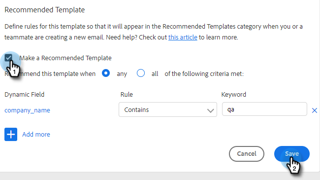

# Plantillas recomendadas {#recommended-templates}

Las plantillas recomendadas de Acción de perspectivas de ventas le ayudan a obtener los mensajes adecuados y a ahorrar tiempo. Esto le proporciona un bueno flujo al enviar correos electrónicos y reduce la incertidumbre al intentar encontrar el correo electrónico adecuado para la persona correcta.

1. Vaya a la pestaña Plantillas .

   

1. Seleccione la plantilla que desee recomendar.

   

1. En la tarjeta Plantilla recomendada, haga clic en **Editar**.

   

1. Seleccione el **Crear una plantilla recomendada** casilla de verificación y haga clic en **Guardar**.

   

>[!NOTE]
>
>Para obtener más información sobre los criterios de plantilla, consulte a continuación.

## Todos vs. Cualquiera {#all-vs-any}

Select **Todo** si desea recomendar la plantilla cuando se cumplan todos los criterios. Select **Cualquiera** si desea recomendar la plantilla cuando se cumpla cualquiera de los criterios.

## Criterios de configuración {#setting-criteria}

Los criterios establecen las condiciones para las que se recomiendan las plantillas. Puede establecer un máximo de 3 fragmentos de criterios. Seleccione primero los campos dinámicos a los que desee apuntar en la plantilla.

## Condiciones {#conditions}

Ahora, seleccione la condición. Cuando se cumplan las condiciones del campo dinámico, se recomienda la plantilla . Elija entre 4 condiciones diferentes.

**Es igual a**: El valor debe ser una coincidencia exacta (por ejemplo, Marketo es igual a Marketo)

**Does not Equal**: El valor debe ser cualquier cosa excepto una coincidencia exacta (por ejemplo, Marketing Nation no es igual a Marketing)

**Contiene**: Solo debe contener el valor (por ejemplo, Marketo Rocks! contiene Marketo)

**No contiene**: El valor no debe estar en el campo dinámico (por ejemplo, Marketo Rocks! no contiene Awesome)

## Aspecto De Una Plantilla Recomendada {#what-a-recommended-template-looks-like}

Ahora que ha asignado su primera plantilla, es hora de asignar el resto. Consulte las plantillas más exitosas y recomiende. No olvide compartir la plantilla con su equipo también. La configuración recomendada para cualquier plantilla también se compartirá con su equipo.
