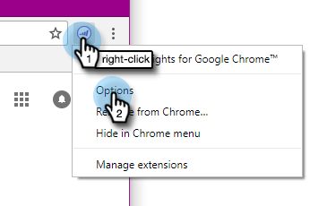

# Instalación de Marketo Insights para Google Chrome {#install-marketo-insights-for-google-chrome}

Siga estos pasos para empezar a utilizar el potente complemento de Chrome.

>[!NOTE]
>
>No es necesario que sea administrador de Marketo para instalar la extensión.

1. Instale el [Marketo Insights for Google Chrome Add in extension](https://chrome.google.com/webstore/detail/marketo-for-google-mail/jjkfbhajlmoeegbjgjipliamplidmbjb) de la tienda web de Chrome.

   

1. Haga clic con el botón derecho en el logotipo de Marketo en Chrome y seleccione **Opciones**.

   

1. Escriba la **Código Reg**, **Dirección de correo electrónico**, **Nombre** y **Apellidos**. Haga clic en **Verificar y guardar**.

   

   >[!CAUTION]
   >
   >Asegúrese de usar su **cuenta de correo electrónico principal** al registrarse, ya que no se admite el uso de alias para este complemento.

   >[!NOTE]
   >
   >El código Reg estará en el correo electrónico enviado después de un administrador de Marketo [emite una licencia de complemento de correo electrónico de Marketo](/help/marketo/product-docs/marketo-sales-insight/msi-outlook-plugin/issue-a-marketo-email-add-in-license.md) [.](https://docs.marketo.com/pages/viewpage.action?pageid=7510848) **Caduca a los 14 días**.

1. Haga clic en **Permitir** para permitir el acceso sin conexión.

   

>[!MORELIKETHIS]
>
>[Uso de Marketo Insights para Google Chrome](/help/marketo/product-docs/marketo-sales-insight/msi-chrome-plugin/using-marketo-insights-for-google-chrome.md)
