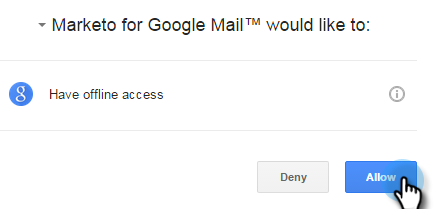

# Instalar Marketo Insights para [!DNL Google Chrome] {#install-marketo-insights-for-google-chrome}

Siga estos pasos para empezar a utilizar el potente complemento de Chrome. No es necesario ser administrador de Marketo para instalar la extensión.

>[!NOTE]
>
>Las funciones de acciones de Sales Insight, como Enviar correo electrónico de ventas, Agregar a la campaña de ventas y Tareas, no están disponibles en los complementos de correo electrónico de Sales Insight para Gmail y Outlook. En este momento, los usuarios solo pueden enviar un correo electrónico rastreable con o sin una plantilla de correo electrónico de Marketo desde su cliente de correo electrónico al utilizar los complementos de correo electrónico de Sales Insight.

1. Instale [Marketo Insights para Google Chrome Add en la extensión](https://chrome.google.com/webstore/detail/marketo-for-google-mail/jjkfbhajlmoeegbjgjipliamplidmbjb){target="_blank"} desde Chrome Web Store.

   

1. Haga clic con el botón derecho en el logotipo de Marketo en [!DNL Chrome] y seleccione **[!UICONTROL Opciones]**.

   

1. Escriba su **[!UICONTROL código de registro]**, **[!UICONTROL dirección de correo electrónico]**, **[!UICONTROL nombre]** y **[!UICONTROL apellido]**. Haga clic en **[!UICONTROL Verificar y guardar]**.

   

   >[!CAUTION]
   >
   >Asegúrese de usar su **cuenta de correo electrónico principal** al registrarse, ya que no se admite el uso de alias para este complemento.

   >[!NOTE]
   >
   >El código de registro aparecerá en el correo electrónico que se enviará después de que un administrador de Marketo [le emita una licencia de complemento de correo electrónico de Marketo](/help/marketo/product-docs/marketo-sales-insight/msi-outlook-plugin/issue-a-marketo-email-add-in-license.md){target="_blank"}. **Caduca después de 14 días**.

1. Haga clic en **[!UICONTROL Permitir]** para permitir el acceso sin conexión.

   

>[!MORELIKETHIS]
>
>[Uso de Marketo Insights para Google Chrome](/help/marketo/product-docs/marketo-sales-insight/msi-chrome-plugin/using-marketo-insights-for-google-chrome.md){target="_blank"}
