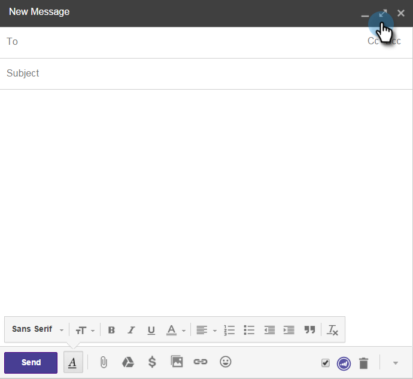

# Uso de perspectivas de marketing para Google Chrome {#using-marketo-insights-for-google-chrome}

Envíe y realice un seguimiento de cualquier correo electrónico de Google con Marketo Insights for Google Chrome.

>[!PREREQUISITES]
>
>[Instalación de perspectivas de marketing para Google Chrome](/help/marketo/product-docs/marketo-sales-insight/msi-chrome-plugin/install-marketo-insights-for-google-chrome.md)

## Enviar un correo electrónico con perspectivas de marketing {#send-an-email-with-marketo-insights}

1. En la ventana Redactar, haga clic en el icono Comercialización.

   

1. ¡El botón Enviar ha convertido a Marketo en morado! Este correo electrónico ahora se enviará con Marketing, se rastrearán todos los vínculos y se insertará un píxel de seguimiento en el correo electrónico. Esto se registrará como una actividad de correo electrónico de ventas enviadas.

   

   >[!NOTE]
   >
   >Un píxel de seguimiento le permite saber quién abrió el correo electrónico.

   >[!TIP]
   >
   >Si lo desea, haga clic en la flecha de doble para expandirse a una vista de pantalla completa.

1. Si desea rellenar previamente el correo electrónico con una plantilla de marketing publicada, haga clic en **Más opciones** y seleccione **Cargar plantilla de marketing**.

   

1. Seleccione una **plantilla disponible** y haga clic en **Aceptar**.

   

1. Introduzca su contenido, una dirección de correo electrónico y haga clic en **Enviar**.

   

   >[!NOTE]
   >
   >Los mensajes solo se rastrean cuando el botón **Enviar** es morado.

1. El mensaje de correo electrónico aparecerá pronto en la perspectiva de ventas de marketing y se realizará un seguimiento de los clics y las aperturas.

   

## Registrar respuestas de correo electrónico con marketing {#log-email-replies-with-marketo}

Puede registrar las respuestas y la actividad antigua en el historial de actividades de un posible cliente.

1. En el panel previsualización de Google Mail, haga clic en **Registro con el marcador**.

   

1. ¡Eso es todo! El mensaje de correo electrónico aparecerá pronto en la Perspectiva de ventas de Marketing to.

   

   >[!MORELIKETHIS]
   >
   >* [Instalación de perspectivas de marketing para Google Chrome](/help/marketo/product-docs/marketo-sales-insight/msi-chrome-plugin/install-marketo-insights-for-google-chrome.md)
   >* [Información y Actividades de persona y cuenta de vista en Google Mail](/help/marketo/product-docs/marketo-sales-insight/msi-chrome-plugin/view-person-and-account-information-and-activities-in-google-mail.md)

