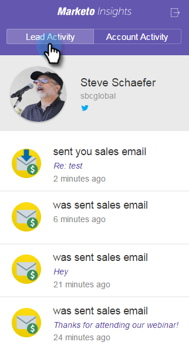
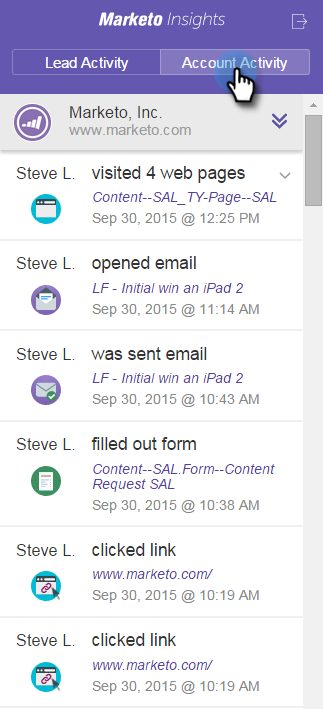
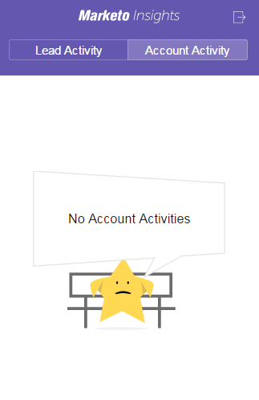
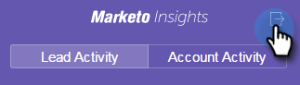
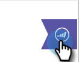
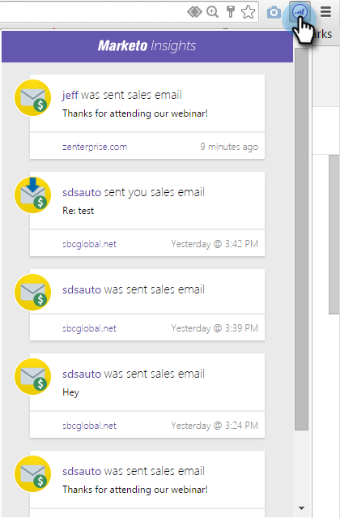

# Ver información e información de cuenta y en el correo de Google {#view-person-and-account-information-and-activities-in-google-mail}

## Ver actividades en Google Mail {#view-activities-in-google-mail}

Utilice el panel contextual Perspectivas de Marketo para ver la información de la cuenta y las actividades recientes.

El panel aparece en el panel de lectura normal de Google Mail para los elementos de la Bandeja de entrada y Enviados, y muestra información y actividades de la persona que le envió el correo electrónico que está leyendo (o a la que envió el correo electrónico para los elementos de la carpeta Enviados).

La pestaña Actividad de la persona muestra información relevante sobre la persona, como su nombre, título, imagen, etc. También puede ver las actividades más recientes que se han producido después de enviar un correo electrónico, como visitar una página web, rellenar un formulario, hacer clic en un vínculo, asistir a un evento y abrir un correo electrónico.

La pestaña Actividad de la cuenta muestra información relevante de la cuenta, como el nombre de la empresa, la dirección URL del sitio web y la ubicación. La pestaña también muestra las actividades de cuenta más recientes. El dominio de persona identifica la cuenta. Las actividades aparecen en la lista si algún usuario de Sales Insight de su suscripción ha establecido correspondencia con ellas.

Si su equipo nunca ha intercambiado un correo electrónico de ventas con la persona, no aparece ninguna actividad.

Haga clic en el icono para contraer el panel.

Haga clic en el icono de Marketo para expandir el panel.

## Ver actividades en [!DNL Google Chrome] {#view-activities-in-google-chrome}

También puede usar el Panel de actividad global de [!DNL Google Chrome] para ver una lista completa de las actividades más recientes que se han producido para todas las personas con las que ha mantenido correspondencia recientemente. Se trata de una fuente actualizada en tiempo real que muestra continuamente el número de actividades no leídas en el icono.

Haga clic en el icono de Marketo para abrir el panel.

>[!MORELIKETHIS]
>
>[Uso de Marketo Insights para [!DNL Google Chrome]](/help/marketo/product-docs/marketo-sales-insight/msi-chrome-plugin/using-marketo-insights-for-google-chrome.md)
