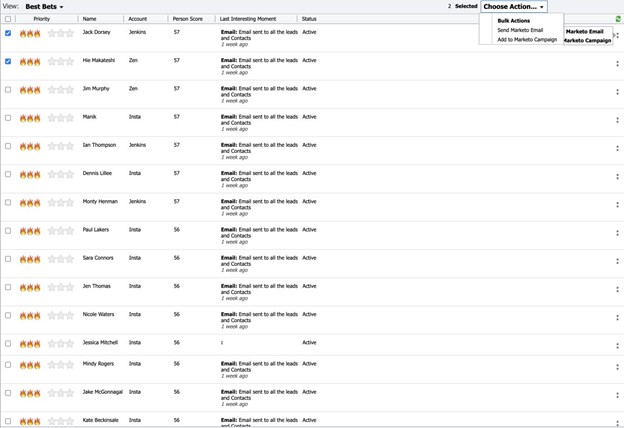

# [!DNL Best Bets] {#best-bets}

La ficha [!UICONTROL resultados más probables] incluye una lista de todos los posibles clientes en función de su prioridad, calculados mediante la urgencia y la puntuación relativa.

Al hacer clic en el menú de puntos debajo de la columna Acciones, puede utilizar opciones de participación como las siguientes:

* [!UICONTROL Enviar correo electrónico de Marketo]
* [!UICONTROL Agregar a Marketo Campaign]

También puede seleccionar varios posibles clientes en la ficha [!DNL Best Bets] y elegir _[!UICONTROL Enviar correo electrónico de Marketo]_ o _[!UICONTROL Agregar a Marketo Campaign]_.

