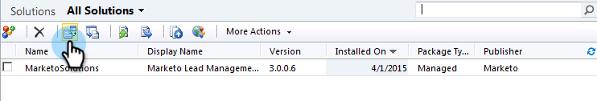
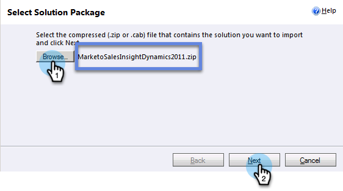
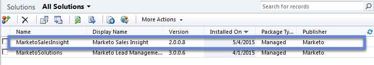
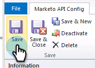
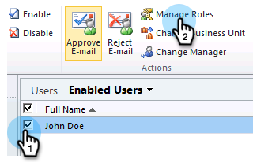
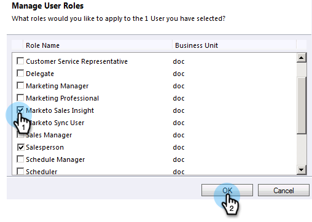

# Instalación y configuración de Marketo Sales Insight en Microsoft Dynamics 2011 {#install-and-configure-marketo-sales-insight-in-microsoft-dynamics}

Marketo Sales Insight es una herramienta fantástica para su equipo de ventas. Esta es una instrucción paso a paso de cómo instalarlo y configurarlo en Microsoft Dynamics 2011 On-Premies.

>[!PREREQUISITES]
>
>Complete la integración Marketo-Microsoft.
>
>[Descargar la solución correcta](/help/marketo/product-docs/marketo-sales-insight/msi-for-microsoft-dynamics/installing/download-the-marketo-sales-insight-solution-for-microsoft-dynamics.md) para su versión de Microsoft Dynamics CRM.

## Importar solución {#import-solution}

1. Inicie sesión en Microsoft Dynamics CRM. Haga clic en **Configuración** en el menú inferior izquierdo.

   

1. Select **Soluciones** en el árbol.

   

1. Haga clic en **Importar** ( ).

   

   >[!NOTE]
   >
   >Ya debería haber [instalado y configurado](/help/marketo/product-docs/marketo-sales-insight/msi-for-microsoft-dynamics/installing/install-and-configure-marketo-sales-insight-in-microsoft-dynamics-2011.md) la solución Marketo antes de avanzar.

1. Haga clic en **Examinar**. Seleccione la solución Perspectiva de ventas de Marketo que desee [descargado](/help/marketo/product-docs/marketo-sales-insight/msi-for-microsoft-dynamics/installing/download-the-marketo-sales-insight-solution-for-microsoft-dynamics.md). Haga clic en **Siguiente**.

   

1. Compruebe los detalles de la solución y haga clic en **Siguiente**.

   

1. Asegúrese de que la opción de mensaje SDK esté seleccionada. Haga clic en **Siguiente**.

   

1. Ahora espere a que finalice la importación.

   

1. Haga clic en **Cerrar**.

   

1. La perspectiva de ventas de Marketo ahora se mostrará en la lista de soluciones. ¡Sí!

   

1. Seleccione Perspectiva de ventas de Marketo y haga clic en **Publicar todas las personalizaciones** ( ).

   

## Conectar Marketo y perspectivas de ventas  {#connect-marketo-and-sales-insight}

>[!NOTE]
>
>**Se requieren permisos de administrador**

1. Inicie sesión en Marketo y haga clic en **Administrador**.

   

1. En el **Perspectiva de ventas** clic en la sección **Editar configuración de API**.

   

1. Copie el **Host de Marketo**, **URL de API** y **ID de usuario de API** para su uso en un paso posterior. Introduzca un **Clave secreta de API** de su elección y haga clic en **Guardar**.

   >[!CAUTION]
   >
   >No use un signo &amp; en la clave secreta de API.

   

   >[!NOTE]
   >
   >Los campos siguientes deben sincronizarse con Marketo para _posible cliente y contacto_ para que funcione Sales Insight:
   >
   >* Prioridad
   >* Urgencia
   >* Puntaje relativo

   >
   >Si falta alguno de estos campos, verá un mensaje de error en Marketo con el nombre de los campos que faltan. Para corregir esto, realice [este procedimiento](/help/marketo/product-docs/marketo-sales-insight/msi-for-microsoft-dynamics/setting-up-and-using/required-fields-for-syncing-marketo-with-dynamics.md).

1. Vuelva a Dynamics y seleccione **Configuración**.

   

1. Select **Configuración de la API de Marketo** en el árbol.

   

1. Haga clic en **Configuración predeterminada**.

   

1. Introduzca la información que tomó de Marketo anteriormente.

   

1. Haga clic en **Guardar**.

   

## Establecer acceso de usuario {#set-user-access}

Configure funciones de usuario para que usuarios específicos tengan acceso a la perspectiva de ventas.

1. Select **Configuración**.

   

1. Select **Administración** en el árbol.

   

1. Haga clic en **Usuarios**.

   

1. Seleccione los usuarios a los que desea conceder acceso y haga clic en **Administrar funciones**.

   

1. Seleccione el **Perspectiva de ventas de Marketo** función y clic **OK**.

   

   ¡Y eso es todo! Todos los usuarios tienen acceso a ahora podrán ver la sección de perspectivas de ventas en la vista de detalles de posible cliente/contacto.

   

   Felicitaciones. Ahora ha liberado la potencia de Marketo Sales Insight.

>[!MORELIKETHIS]
>
>[Configuración de estrellas y llamas para registros de posible cliente/contacto](/help/marketo/product-docs/marketo-sales-insight/msi-for-microsoft-dynamics/setting-up-and-using/setting-up-stars-and-flames-for-lead-contact-records.md)
