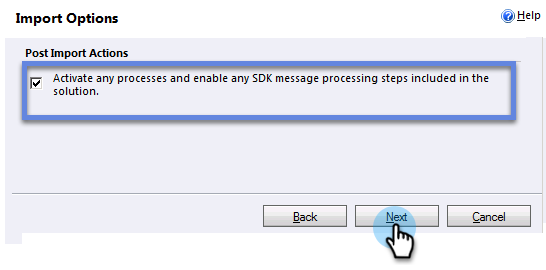

# Instalar y configurar [!DNL Marketo Sales Insight] en [!DNL Microsoft Dynamics 2011] {#install-and-configure-marketo-sales-insight-in-microsoft-dynamics}

[!DNL Marketo Sales Insight] es una herramienta fantástica para su equipo de ventas. Esta es la instrucción paso a paso de cómo instalarla y configurarla en [!DNL Microsoft Dynamics 2011] local.

>[!PREREQUISITES]
>
>Complete la integración de Marketo y Microsoft.
>
>[Descargue la solución correcta](/help/marketo/product-docs/marketo-sales-insight/msi-for-microsoft-dynamics/installing/download-the-marketo-sales-insight-solution-for-microsoft-dynamics.md) para su versión de [!DNL Microsoft Dynamics] CRM.

## Importar solución {#import-solution}

1. Iniciar sesión en [!DNL Microsoft Dynamics] CRM. Haga clic en **[!UICONTROL Configuración]** en el menú inferior izquierdo.

   

1. Seleccione **[!UICONTROL Soluciones]** en el árbol.

   

1. Haga clic en **Importar** ( ).

   

   >[!NOTE]
   >
   >Ya debería tener [instalada y configurada](/help/marketo/product-docs/marketo-sales-insight/msi-for-microsoft-dynamics/installing/install-and-configure-marketo-sales-insight-in-microsoft-dynamics-2011.md) la solución de Marketo antes de continuar.

1. Haga clic en **[!UICONTROL Examinar]**. Seleccione la solución [!DNL Marketo Sales Insight] que [descargó](/help/marketo/product-docs/marketo-sales-insight/msi-for-microsoft-dynamics/installing/download-the-marketo-sales-insight-solution-for-microsoft-dynamics.md). Haga clic en **[!UICONTROL Siguiente]**.

   

1. Compruebe los detalles de la solución y haga clic en **[!UICONTROL Siguiente]**.

   

1. Asegúrese de que la opción SDK message esté seleccionada. Haga clic en **[!UICONTROL Siguiente]**.

   

1. Ahora espere a que finalice la importación.

   

1. Haga clic en **[!UICONTROL Cerrar]**.

   

1. [!DNL Marketo Sales Insight] aparecerá ahora en la lista de soluciones. ¡Yay!

   

1. Seleccione [!DNL Marketo Sales Insight] y haga clic en **Publicar todas las personalizaciones** ( ).

   

## Conectar Marketo y Sales Insight  {#connect-marketo-and-sales-insight}

>[!NOTE]
>
>**Se requieren permisos de administración**

1. Inicie sesión en Marketo y haga clic en **[!UICONTROL Administrador]**.

   

1. En la sección **[!UICONTROL Sales Insight]**, haga clic en **[!UICONTROL Editar configuración de API]**.

   

1. Copie **[!UICONTROL Marketo Host]**, **[!UICONTROL API URL]** y **[!UICONTROL API User Id]** para usarlos en un paso posterior. Escribe una **[!UICONTROL clave secreta de API]** de tu elección y haz clic en **[!UICONTROL Guardar]**.

   >[!CAUTION]
   >
   >No use el signo &amp; en la clave secreta de la API.

   

   >[!NOTE]
   >
   >Los campos siguientes se deben sincronizar con Marketo para que _tanto el posible cliente como el contacto_ funcionen para Sales Insight:
   >
   >* Prioridad
   >* Urgencia
   >* Puntaje relativo
   >
   >Si falta alguno de estos campos, verá un mensaje de error en Marketo con el nombre de los campos que faltan. Para solucionarlo, realice [este procedimiento](/help/marketo/product-docs/marketo-sales-insight/msi-for-microsoft-dynamics/setting-up-and-using/required-fields-for-syncing-marketo-with-dynamics.md).

1. Vuelva a Dynamics y seleccione **[!UICONTROL Configuración]**.

   

1. Seleccione **[!UICONTROL Configuración de la API de Marketo]** en el árbol.

   

1. Haga clic en **[!UICONTROL Configuración predeterminada]**.

   

1. Escriba la información que tomó de Marketo anteriormente.

   

1. Haga clic en **[!UICONTROL Guardar]**.

   

## Definir acceso de usuario {#set-user-access}

Configure los roles de usuario para que determinados usuarios tengan acceso a [!DNL Sales Insight].

1. Seleccione **[!UICONTROL Configuración]**.

   

1. Seleccione **[!UICONTROL Administración]** en el árbol.

   

1. Haga clic en **[!UICONTROL Usuarios]**.

   

1. Seleccione a los usuarios a los que desea conceder acceso y haga clic en **[!UICONTROL Administrar roles]**.

   

1. Seleccione el rol de **[!UICONTROL Marketo Sales Insight]** y haga clic en **[!UICONTROL Aceptar]**.

   

   ¡Y eso es todo! Todos los usuarios que tengan acceso ahora podrán ver la sección de insight de ventas en la vista de detalles del posible cliente/contacto.

   

   Enhorabuena. Ahora ha liberado el poder de [!DNL Marketo Sales Insight].

>[!MORELIKETHIS]
>
>[Configuración de estrellas y llamas para registros de contactos o posibles clientes](/help/marketo/product-docs/marketo-sales-insight/msi-for-microsoft-dynamics/setting-up-and-using/setting-up-stars-and-flames-for-lead-contact-records.md)
