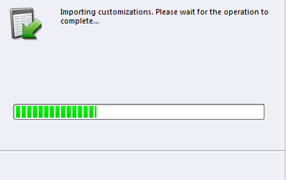

# Instalar y configurar MarketingTo Sales Insight en Microsoft Dynamics 2011 {#install-and-configure-marketo-sales-insight-in-microsoft-dynamics}

La perspectiva de ventas de marketing es una herramienta fantástica para su equipo de ventas. Esta es la instrucción paso a paso de cómo instalarla y configurarla en locales de Microsoft Dynamics 2011.

>[!PREREQUISITES]
>
>Complete la integración [de Marketing a Microsoft](http://docs.marketo.com/x/DoA2).
>
>[Descargue la ](http://docs.marketo.com/x/LoJo) solución correcta para su versión de Microsoft Dynamics CRM.

## Importar solución {#import-solution}

1. Inicie sesión en Microsoft Dynamics CRM. Haga clic en **Configuración** en el menú inferior izquierdo.

   

1. Seleccione **Soluciones** en el árbol.

   

1. Haga clic en **Importar** ( ).

   

   >[!NOTE]
   >
   >**Recordatorio**
   >
   >
   >Ya debe tener [instalado y configurado](install-and-configure-marketo-sales-insight-in-microsoft-dynamics-2011.md) la solución de Marketing para avanzar.

1. Haga clic en **Examinar**. Seleccione la solución de perspectiva de ventas de marketing que [descargó](download-the-marketo-sales-insight-solution-for-microsoft-dynamics.md). Haga clic en **Siguiente**.

   

1. Compruebe los detalles de la solución y haga clic en **Siguiente**.

   

1. Asegúrese de que la opción de mensaje SDK está marcada. Haga clic en **Siguiente**.

   

1. Ahora espere a que finalice la importación.

   

1. Haga clic en **Cerrar**.

   

1. La perspectiva de ventas de marketing ahora se mostrará en la lista de la solución. ¡Sí!

   

1. Seleccione Marketing to Sales Insight y haga clic en **Publicar todas las personalizaciones** ( ).

   

## Connect Marketing y perspectiva de ventas {#connect-marketo-and-sales-insight}

>[!NOTE]
>
>**Se requieren permisos de administración**

1. Inicie sesión en Marketing y haga clic en **Administración**.

   

1. En la sección **Perspectiva de ventas **haga clic en **Editar configuración de API**.

   

1. Copie el **host de marketing**, **URL de API** y el **ID de usuario de API** para usarlos en un paso posterior. Escriba una **Clave secreta de API** de su elección y haga clic en **GUARDAR**.

   >[!CAUTION]
   >
   >No utilice un símbolo &amp; en la clave secreta de API.

   

   >[!NOTE]
   >
   >Los siguientes campos deben sincronizarse con Marketing para *Posible cliente y Contacto* para que Sales Insight funcione:
   >
   >    
   >    
   >    * Prioridad
   >    * Urgencia
   >    * Puntuación relativa

   >    
   >    
   >Si falta alguno de estos campos, verá un mensaje de error en el menú de marketing con el nombre de los campos que faltan. Para solucionarlo, realice [este procedimiento](../../../../product-docs/marketo-sales-insight/msi-for-microsoft-dynamics/setting-up-and-using/required-fields-for-syncing-marketo-with-dynamics.md).

1. Vuelva a Dynamics, seleccione **Configuración**.

   

1. Seleccione **Configuración de API de marketing** en el árbol.

   

1. Haga clic en **Configuración predeterminada**.

   

1. Escriba la información que tomó de Marketing anteriormente.

   

1. Haga clic en **Guardar.**

   ** 

   **

## Establecer acceso de usuario {#set-user-access}

Configure las funciones de usuario para que los usuarios específicos tengan acceso a la perspectiva de ventas.

1. Seleccione **Configuración**.

   

1. Seleccione **Administración** en el árbol.

   

1. Haga clic en **Usuarios**.

   

1. Seleccione los usuarios a los que desea otorgar acceso y haga clic en **Administrar funciones**.

   

1. Seleccione la función **Marketing to Sales Insight** y haga clic en **Aceptar**.

   

   ¡Y eso es todo! Ahora todos los usuarios tendrán acceso a la sección de perspectiva de ventas de la vista de detalles de contacto/posible cliente.

   

   Felicidades. Ahora ha desatado la potencia de Marketingto Sales Insight.

>[!NOTE]
>
>**Artículos relacionados**
>
>[Configuración de estrellas y llamas para registros de contacto/posibles clientes](http://docs.marketo.com/x/BICMAg)

