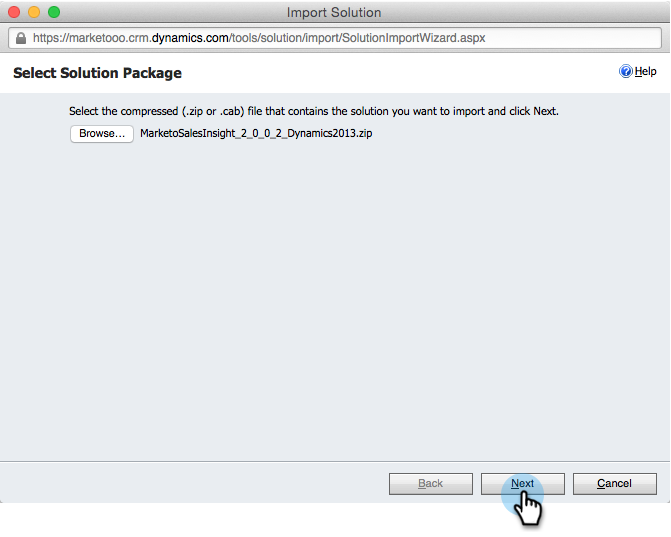

# Instalar y configurar [!DNL Marketo Sales Insight] en [!DNL Microsoft Dynamics 2013] {#install-and-configure-marketo-sales-insight-in-microsoft-dynamics}

[!DNL Marketo Sales Insight] es una herramienta fantástica para ofrecer a su equipo de ventas una &quot;ventana&quot; sobre la gran cantidad de datos que tiene el equipo de marketing. A continuación se muestra cómo instalarlo y configurarlo.

>[!PREREQUISITES]
>
>Complete la integración de Marketo y Microsoft.
>
>[Descargue la solución correcta](/help/marketo/product-docs/marketo-sales-insight/msi-for-microsoft-dynamics/installing/download-the-marketo-sales-insight-solution-for-microsoft-dynamics.md) para su versión de [!DNL Microsoft Dynamics] CRM.

## Importar solución {#import-solution}

Bien, ahora es el momento de importar la solución [!DNL Marketo Sales Insight] en [!DNL Microsoft Dynamics].

1. En **[!UICONTROL Microsoft Dynamics CRM]**, haga clic en **[!UICONTROL Configuración]**.

   

1. En **[!UICONTROL Configuración]**, haga clic en **[!UICONTROL Personalizaciones]**.

   

1. Haga clic en **[!UICONTROL Soluciones]**.

   

   >[!NOTE]
   >
   >Ya debería haber instalado y configurado Marketo antes de continuar

1. Haga clic en **[!UICONTROL Importar]**.

   

1. En la nueva ventana, haz clic en **[!UICONTROL Examinar]**.

   

1. Busque y seleccione la solución que descargó anteriormente.

   

1. Haga clic en **[!UICONTROL Siguiente]**.

   

1. Se cargará la solución. Si lo desea, puede ver el contenido del paquete. Haga clic en **[!UICONTROL Siguiente]**.

   

1. Asegúrese de dejar la casilla marcada y haga clic en **[!UICONTROL Importar]**.

   

1. No dude en descargar el archivo de registro. Haga clic en **[!UICONTROL Cerrar]**.

   

1. ¡Fantástico! Debería ver la solución ahora. Si no está allí, actualice la pantalla.

   

## Conectar Marketo y Sales Insight {#connect-marketo-and-sales-insight}

Vinculemos su instancia de Marketo a [!DNL Sales Insight] en [!DNL Dynamics].

>[!NOTE]
>
>Se requieren derechos de administrador.

1. Inicie sesión en Marketo y vaya a la sección **[!UICONTROL Admin]**.

   

1. En la sección **[!UICONTROL Sales Insight]**, haga clic en **[!UICONTROL Editar configuración de API]**.

   

1. Copie **[!UICONTROL Marketo Host]**, **[!UICONTROL API URL]** y **[!UICONTROL API User Id]** para usarlos en un paso posterior. Escribe una **[!UICONTROL clave secreta de API]** de tu elección y haz clic en **[!UICONTROL Guardar]**.

   >[!CAUTION]
   >
   >No use el signo &amp; en la clave secreta de la API.

   

   >[!NOTE]
   >
   >Los campos siguientes se deben sincronizar con Marketo para que _tanto el posible cliente como el contacto_ funcionen para Sales Insight:
   >
   >* Prioridad
   >* Urgencia
   >* Puntaje relativo
   >
   >Si falta alguno de estos campos, verá un mensaje de error en Marketo con el nombre de los campos que faltan. Para solucionarlo, realice [este procedimiento](/help/marketo/product-docs/marketo-sales-insight/msi-for-microsoft-dynamics/setting-up-and-using/required-fields-for-syncing-marketo-with-dynamics.md).

1. En [!DNL Microsoft Dynamics], ve a **[!UICONTROL Configuración]**.

   

1. En **[!UICONTROL Configuración]**, haga clic en **[!UICONTROL Configuración de la API de Marketo]**.

   

1. Haga clic en **[!UICONTROL Nuevo]**.

   

1. Escriba la información que tomó de Marketo anteriormente y haga clic en **[!UICONTROL Guardar]**.

   

## Definir acceso de usuario {#set-user-access}

Por último, puede otorgar acceso a [!DNL Marketo Sales Insight] a usuarios concretos.

1. Vaya a **[!UICONTROL Configuración]**.

   

1. Haga clic en **[!UICONTROL Usuarios]**.

   

1. Seleccione a los usuarios a los que desea otorgar acceso a Sales Insight y haga clic en **[!UICONTROL Administrar roles]**.

   

1. Seleccione el rol de **[!UICONTROL Marketo Sales Insight]** y haga clic en **[!UICONTROL Aceptar]**.

   

   ¡Y tú deberías haber terminado! Por último, para realizar pruebas, inicie sesión en [!DNL Dynamics] como usuario que tiene acceso a [!DNL Marketo Sales Insight] y observe a un posible cliente o contacto.

   

Ahora ha desbloqueado el poder de [!DNL Marketo Sales Insight] para su equipo de ventas.

>[!MORELIKETHIS]
>
>[Configuración de estrellas y llamas para registros de contactos o posibles clientes](/help/marketo/product-docs/marketo-sales-insight/msi-for-microsoft-dynamics/setting-up-and-using/setting-up-stars-and-flames-for-lead-contact-records.md)
