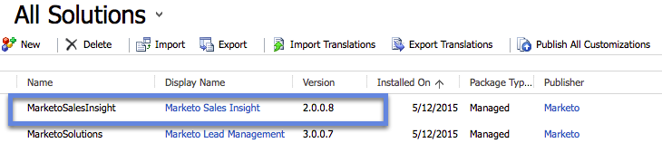
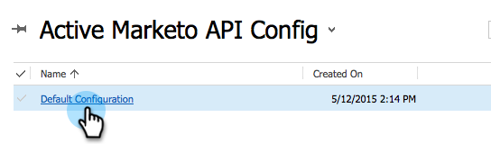
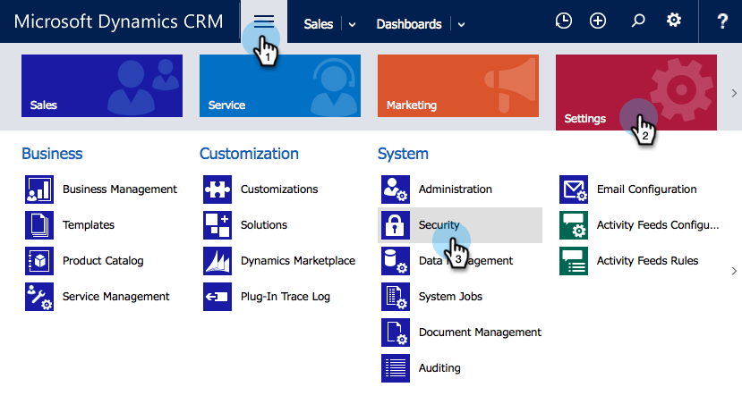

# Instalación y configuración de Marketo Sales Insight en Microsoft Dynamics 365 {#install-and-configure-marketo-sales-insight-in-microsoft-dynamics}

Marketo Sales Insight es una herramienta fantástica para ofrecer a su equipo de ventas una &quot;ventana&quot; de la riqueza de datos que posee el equipo de marketing. Así es como instalar y configurar.

>[!PREREQUISITES]
>
>Complete la integración Marketo-Microsoft.
>
>[Descargar la solución correcta](/help/marketo/product-docs/marketo-sales-insight/msi-for-microsoft-dynamics/installing/download-the-marketo-sales-insight-solution-for-microsoft-dynamics.md) para su versión de Microsoft Dynamics CRM.

## Importar solución {#import-solution}

1. Iniciar sesión en [Microsoft Office 365](https://login.microsoftonline.com/).

   

1. Haga clic en el  y seleccione **CRM**.

   

1. Haga clic en el  para abrir el Navegador. En la lista desplegable , seleccione **Configuración** y, a continuación, seleccione **Soluciones**.

   

   >[!NOTE]
   >
   >Ya debería haber [instalar y configurar la solución Marketo](/help/marketo/product-docs/crm-sync/microsoft-dynamics-sync/sync-setup/microsoft-dynamics-365-with-ropc-connection/step-1-of-4-install.md) antes de avanzar.

1. Haga clic en **Importar**.

   

1. En la nueva ventana, haga clic en **Examinar**. Elija la [La solución Perspectiva de ventas de Marketo que descargó en el paso 1](#msi). Haga clic en **Siguiente**.

   

1. Se cargará la solución. Puede ver el contenido del paquete si lo desea. Haga clic en **Siguiente**.

   

1. Asegúrese de dejar la casilla **activado** y haga clic en **Importar**.

   

1. No dude en descargar el archivo de registro. Haga clic en **Cerrar**.

   

1. ¡Increíble! Debería ver la solución ahora. Si no está allí, actualice la pantalla.

   

1. Haga clic en **Publicar todas las personalizaciones**.

   

## Conectar Marketo y perspectivas de ventas {#connect-marketo-and-sales-insight}

Vincule su instancia de Marketo con la perspectiva de ventas en Dynamics. Así es como:

>[!NOTE]
>
>**Se requieren permisos de administrador**

1. Inicie sesión en Marketo y vaya a la **Administrador** para obtener más información.

   

1. En el **Perspectiva de ventas** , haga clic en **Editar configuración de API**.

   

1. Copie el **Host de Marketo**, **URL de API** y **ID de usuario de API** para su uso en un paso posterior. Introduzca un **Clave secreta de API** de su elección y haga clic en **Guardar**.

   >[!CAUTION]
   >
   >No use un signo &amp; en la clave secreta de API.

   

   >[!NOTE]
   >
   >Los campos siguientes deben sincronizarse con Marketo para _posible cliente y contacto_ para que funcione Sales Insight:
   >
   > * Prioridad
   > * Urgencia
   > * Puntaje relativo

   >
   >Si falta alguno de estos campos, verá un mensaje de error en Marketo con el nombre de los campos que faltan. Para corregir esto, realice [este procedimiento](/help/marketo/product-docs/marketo-sales-insight/msi-for-microsoft-dynamics/setting-up-and-using/required-fields-for-syncing-marketo-with-dynamics.md).

1. En Microsoft Dynamics, haga clic en el botón  junto a Configuración y, a continuación, seleccione **Configuración de la API de Marketo** en la lista desplegable .

   

1. Haga clic en **Configuración predeterminada**.

   

1. Introduzca la información que ha copiado de Marketo anteriormente.

   

1. Haga clic en el  en la esquina inferior derecha para guardar los cambios.

## Establecer acceso de usuario {#set-user-access}

Debe otorgar a los usuarios permisos para utilizar la perspectiva de ventas.

1. Haga clic en el  para abrir el Navegador. En el menú desplegable , seleccione **Configuración** y, a continuación, seleccione **Seguridad**.

   

1. Haga clic en **Usuarios**.

   

1. Seleccione los usuarios a los que desea conceder acceso a la perspectiva de ventas y haga clic en **Administrar funciones**.

   

1. Seleccione el **Perspectiva de ventas de Marketo** función y clic **OK**.

   

   ¡Y todos deberían haber terminado! Finalmente, para probar, inicie sesión en Dynamics como usuario que tiene acceso a Marketo Sales Insight y observe un posible cliente o contacto.

   

Ahora ha desbloqueado la potencia de Marketo Sales Insight para su equipo de ventas.

>[!MORELIKETHIS]
>
>[Configuración de estrellas y llamas para registros de posible cliente/contacto](/help/marketo/product-docs/marketo-sales-insight/msi-for-microsoft-dynamics/setting-up-and-using/setting-up-stars-and-flames-for-lead-contact-records.md)
