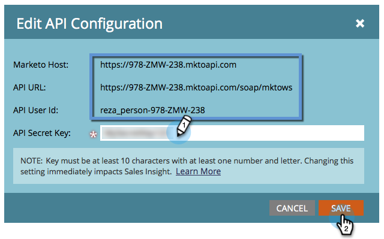

# Instalación y configuración de Marketo Sales Insight en Microsoft Dynamics Online {#install-and-configure-marketo-sales-insight-in-microsoft-dynamics-online}

Marketo Sales Insight es una herramienta fantástica para ofrecer a su equipo de ventas una &quot;ventana&quot; de la riqueza de datos que posee el equipo de marketing. Así es como instalarlo y configurarlo en Microsoft Dynamics Online.

>[!PREREQUISITES]
>
>Complete la integración Marketo-Microsoft.
>
>[Descargar la solución correcta](/help/marketo/product-docs/marketo-sales-insight/msi-for-microsoft-dynamics/installing/download-the-marketo-sales-insight-solution-for-microsoft-dynamics.md) para su versión de Microsoft Dynamics CRM.

## Importar solución {#import-solution}

>[!NOTE]
>
>Si utiliza la interfaz unificada, antes del paso 1 a continuación, haga clic en el icono Configuración en la esquina superior derecha y seleccione **Configuración avanzada**.

1. En Microsoft Dynamics CRM, haga clic en **Configuración**.

   

1. En Configuración, haga clic en **Personalizaciones**.

   

1. Haga clic en **Soluciones**.

   

   >[!NOTE]
   >
   >Ya debería haber instalado y configurado la solución Marketo antes de seguir adelante.

1. Haga clic en **Importar**.

   

1. En la nueva ventana, haga clic en **Examinar**.

   

1. En el equipo, busque e instale la solución que acaba de descargar.

1. Haga clic en **Siguiente**.

   

1. Se cargará la solución. Puede ver el contenido del paquete si lo desea. Haga clic en **Siguiente**.

   

1. Asegúrese de dejar la casilla marcada y haga clic en **Importar**.

   

1. Siéntase libre de descargar el archivo de registro y luego haga clic en **Cerrar**.

   

1. ¡Increíble! Debería ver la solución ahora. Si no está allí, actualice la pantalla.

   

1. Haga clic en **Personalización de publicación**.

   >[!NOTE]
   >
   >Asegúrese de habilitar la sincronización de Global MS Dynamics.

## Conectar Marketo y perspectivas de ventas {#connect-marketo-and-sales-insight}

Vincule su instancia de Marketo con la perspectiva de ventas en Dynamics. A continuación se muestra cómo:

>[!NOTE]
>
>**Se requieren permisos de administrador**

1. Inicie sesión en Marketo y vaya a la **Administrador** para obtener más información.

   

1. En la sección Perspectiva de ventas , haga clic en **Editar configuración de API**.

   

1. Copie el **Host de Marketo**, **URL de API** y **ID de usuario de API** para su uso en un paso posterior. Introduzca una clave secreta de API de su elección y haga clic en **Guardar**.

   >[!CAUTION]
   >
   >No use un signo &amp; en la clave secreta de API.

   

   >[!NOTE]
   >
   >Los campos siguientes deben sincronizarse con Marketo para _posible cliente y contacto_ para que funcione Sales Insight:
   >
   >* Prioridad
   >* Urgencia
   >* Puntaje relativo

   >
   >Si falta alguno de estos campos, verá un mensaje de error en Marketo con el nombre de los campos que faltan. Para corregir esto, realice [este procedimiento](/help/marketo/product-docs/marketo-sales-insight/msi-for-microsoft-dynamics/setting-up-and-using/required-fields-for-syncing-marketo-with-dynamics.md).

1. De vuelta a Microsoft Dynamics, vaya a **Configuración**.

   

1. En **Configuración**, haga clic en **Configuración de la API de Marketo**.

   

1. Haga clic en **Nuevo**.

   

1. Introduzca la información que tomó de Marketo anteriormente y haga clic en **Guardar**.

   

## Habilitar sincronización {#enable-sync}

1. En Marketo, haga clic en **Administrador**.

   

1. En Integración, seleccione **Microsoft Dynamics**.

   

1. Haga clic en **Habilitar sincronización**.

   

1. Haga clic en **Editar** junto a Detalles de sincronización de campos.

   

1. Esto _automatically_ seleccione los campos MSI que anteriormente estaban desactivados (Urgencia, Puntuación relativa y Prioridad). Simplemente haga clic en **Guardar** para iniciar la sincronización de datos.

   

## Establecer acceso de usuario {#set-user-access}

Por último, debe dar acceso a usuarios específicos para que utilicen la perspectiva de ventas de Marketo.

1. Vaya a **Configuración**.

   

1. Vaya a **Seguridad**.

   

1. Haga clic en **Usuarios**.

   

1. Seleccione a los usuarios a los que desea conceder acceso a la perspectiva de ventas y haga clic en **Administrar funciones**.

   

1. Seleccione la función Perspectiva de ventas de Marketo y haga clic en **OK**.

   

   ¡Y todos deberían haber terminado! Finalmente, para probar, inicie sesión en Dynamics como usuario que tiene acceso a Marketo Sales Insight y observe un posible cliente o contacto.

   

>[!MORELIKETHIS]
>
>[Configuración de estrellas y llamas para registros de posible cliente/contacto](/help/marketo/product-docs/marketo-sales-insight/msi-for-microsoft-dynamics/setting-up-and-using/setting-up-stars-and-flames-for-lead-contact-records.md)
