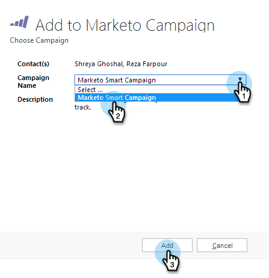

# Agregar un posible cliente/contacto a una campaña de Marketo desde [!DNL Microsoft Dynamics] {#add-a-lead-contact-to-a-marketo-campaign-from-microsoft-dynamics}

Puede agregar rápida y fácilmente posibles clientes o contactos a las campañas inteligentes de Marketo directamente desde [!DNL Microsoft Dynamics]. Así es como.

1. En [!DNL Dynamics], vaya al área de **[!UICONTROL Ventas]**.

   

1. Seleccione una vista.

   

1. Seleccione uno o varios posibles clientes o contactos.

   

1. Haga clic en **...** y seleccione **[!UICONTROL Agregar a Marketo Campaign]**.

   

1. Seleccione la campaña de Marketo a la que desee agregar los posibles clientes o contactos y haga clic en **[!UICONTROL Agregar]**.

   

   >[!NOTE]
   >
   >Para que la campaña aparezca en la lista desplegable, use el déclencheur [**Se solicita la campaña**](/help/marketo/product-docs/core-marketo-concepts/smart-campaigns/using-smart-campaigns/setting-up-a-trigger-smart-campaign-for-sales-using-campaign-is-requested.md), con [!DNL Sales Insight] como origen, al configurar la campaña.

¡Y eso es todo! Ahora tiene el poder de las campañas inteligentes de Marketo en sus manos directamente desde [!DNL Dynamics].
