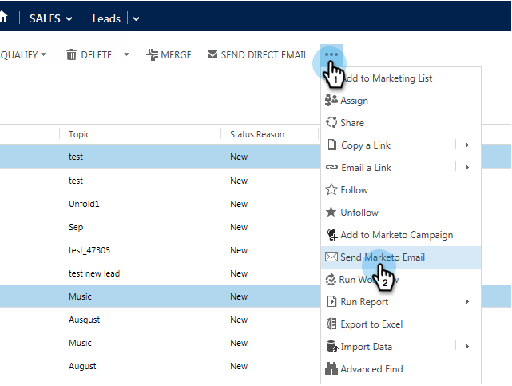
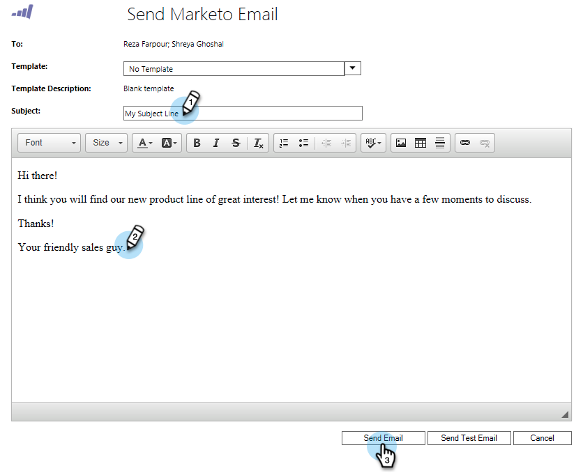

# Enviar un mensaje de correo electrónico de [!DNL Marketo Sales] desde [!DNL Microsoft Dynamics] {#send-a-marketo-sales-email-from-microsoft-dynamics}

Su equipo de ventas puede enviar correos electrónicos y hacer que los rastreen en busca de aperturas y clics directamente desde dentro de [!DNL Microsoft Dynamics]. Así es cómo se hace.

1. En [!DNL Dynamics], vaya al área de **[!UICONTROL Ventas]**.

   

1. Seleccione una **[!UICONTROL vista de sistema]**.

   

1. Seleccione uno o varios posibles clientes.

   

1. Haga clic en la ficha **...** y, a continuación, haga clic en **[!UICONTROL Enviar correo electrónico de Marketo]**.

   

   >[!TIP]
   >
   >Puede [publicar correos electrónicos como plantillas](/help/marketo/product-docs/marketo-sales-insight/msi-for-salesforce/features/actions-in-the-msi-panel/send-marketo-email/publish-an-email-to-sales-insight.md) para que los use su equipo de ventas.

1. Agrega un asunto, redacta tu correo electrónico y haz clic en **[!UICONTROL Enviar correo electrónico]**. (Elija una plantilla si la necesita).

   

   >[!TIP]
   >
   >Primero puede hacer clic en **Enviar correo electrónico de prueba** y se le enviará el correo electrónico (la dirección de correo electrónico principal de Microsoft Dynamics) antes de enviar el correo electrónico real.

   >[!NOTE]
   >
   >Puede enviar hasta 300 correos electrónicos de Marketo a la vez.

¡Bien hecho! Ahora sabe cómo enviar correos electrónicos rastreados de Marketo directamente desde [!DNL Microsoft Dynamics].

>[!MORELIKETHIS]
>
>[Agregar un posible cliente/contacto a una campaña de Marketo desde [!DNL Microsoft Dynamics]](/help/marketo/product-docs/marketo-sales-insight/msi-for-microsoft-dynamics/setting-up-and-using/add-a-lead-contact-to-a-marketo-campaign-from-microsoft-dynamics.md)
