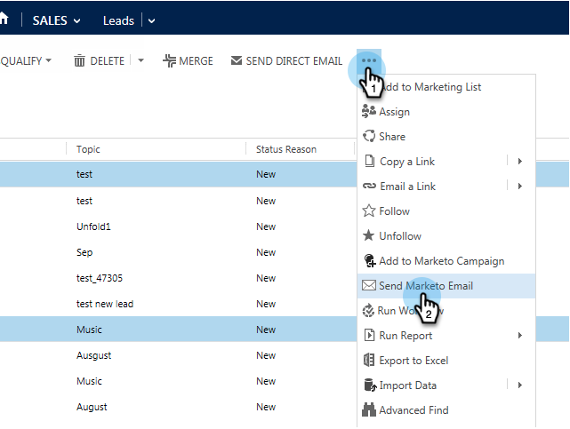

# Enviar un correo electrónico de ventas de Marketo desde Microsoft Dynamics {#send-a-marketo-sales-email-from-microsoft-dynamics}

El equipo de ventas puede enviar correos electrónicos y hacer que se les realice un seguimiento de las aperturas y los clics directamente desde Microsoft Dynamics. Así es como.

1. En Dynamics, vaya a la **Ventas** .

   

1. Seleccione un **Vista del sistema**.

   

1. Seleccione uno o más posibles clientes.

   

1. Haga clic en el **...** a continuación, haga clic en **Enviar correo electrónico de Marketo**.

   

   >[!TIP]
   >
   >Puede [publicar correos electrónicos como plantillas](/help/marketo/product-docs/marketo-sales-insight/msi-for-salesforce/features/actions-in-the-msi-panel/send-marketo-email/publish-an-email-to-sales-insight.md) para su equipo de ventas.

1. Añada un asunto, redacte su correo electrónico y haga clic en **Enviar correo electrónico**. (Elija una plantilla si la necesita).

   

   Puede hacer clic en **Enviar mensaje de prueba** primero y el correo electrónico se le enviará (dirección de correo electrónico principal en Microsoft Dynamics) antes de enviar el correo electrónico real.

¡Bien hecho! Ahora sabe cómo enviar correos electrónicos rastreados de Marketo directamente desde Microsoft Dynamics.

>[!MORELIKETHIS]
>
>[Agregar un posible cliente o contacto a una campaña de Marketo desde Microsoft Dynamics](/help/marketo/product-docs/marketo-sales-insight/msi-for-microsoft-dynamics/setting-up-and-using/add-a-lead-contact-to-a-marketo-campaign-from-microsoft-dynamics.md)
