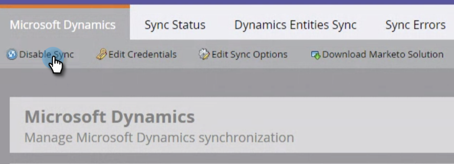

# Deshabilitar sincronización global [!DNL MS Dynamics] {#disable-global-ms-dynamics-sync}

Siga estos sencillos pasos para deshabilitar la sincronización de [!DNL MS Dynamics].

1. En Marketo, haga clic en **[!UICONTROL Administrador]**.

   

1. En [!UICONTROL Integración], haga clic en **[!UICONTROL Microsoft Dynamics]**.

   

1. Haga clic en **[!UICONTROL Deshabilitar sincronización]**.

   

   >[!NOTE]
   >
   >Si no ves un botón [!UICONTROL Deshabilitar sincronización] en tu instancia, ponte en contacto con el [Soporte técnico de Marketo](https://nation.marketo.com/t5/Support/ct-p/Support).
