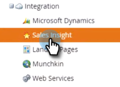
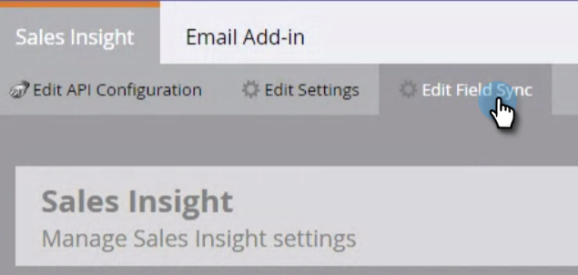
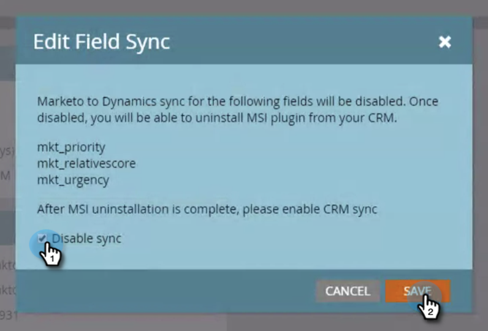

# Desinstalar MSI de su instancia de MS [!DNL Dynamics] {#uninstall-msi-from-your-ms-dynamics-instance}

Para desinstalar MSI de la instancia de MS [!DNL Dynamics], deberá realizar los pasos en Marketo y MS [!DNL Dynamics].

>[!PREREQUISITES]
>
>[Deshabilitar MS global [!DNL Dynamics] Sync](/help/marketo/product-docs/marketo-sales-insight/msi-for-microsoft-dynamics/uninstalling/disable-global-ms-dynamics-sync.md)

1. En Marketo, haga clic en **[!UICONTROL Administrador]**.

   

1. Haga clic en **[!UICONTROL Insight de ventas]**.

   

1. Haga clic en **[!UICONTROL Editar sincronización de campos]**.

   

1. Seleccione la casilla de verificación **[!UICONTROL Deshabilitar sincronización]** y haga clic en **[!UICONTROL Guardar]**.

   >[!NOTE]
   >
   >Asegúrese de [deshabilitar la sincronización global de MS Dynamics](/help/marketo/product-docs/marketo-sales-insight/msi-for-microsoft-dynamics/uninstalling/disable-global-ms-dynamics-sync.md) antes de deshabilitar la sincronización de campos.

   

## Los siguientes pasos tienen lugar en su instancia de MS [!DNL Dynamics]: {#the-following-steps-take-place-in-your-ms-dynamics-instance}

1. Haga clic en **[!UICONTROL Configuración avanzada]**.

1. Haga clic en **[!UICONTROL Soluciones]**.

1. Seleccione **[!UICONTROL Marketo Sales Insight]** y haga clic en el icono Eliminar.

1. Cuando aparezca el modal Desinstalar solución, haz clic en **[!UICONTROL Aceptar]**.

   La solución MS [!DNL Dynamics] tarda aproximadamente 20 minutos en desinstalarse completamente. Sin embargo, si tiene una instancia de MS [!DNL Dynamics] grande, podría tardar un poco más.

   >[!NOTE]
   >
   >Recuerde activar la sincronización de MS global [!DNL Dynamics] una vez que desinstale MSI.
