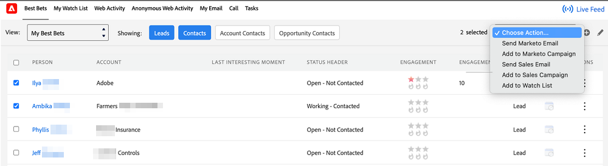

# Añadir la ficha Marketo a Salesforce {#add-marketo-tab-to-salesforce}

1. En Salesforce, haga clic en **+** y haga clic en **Personalizar mis fichas**.

   

1. Seleccione Marketo en la lista de la izquierda. A continuación, haga clic en **Agregar** para agregarlo al **Pestañas seleccionadas**.

   >[!TIP]
   >
   >Utilice la variable **Up** y **Down** para reordenar las pestañas.

   

   ¡Y aquí está su pestaña de Marketo!

   
