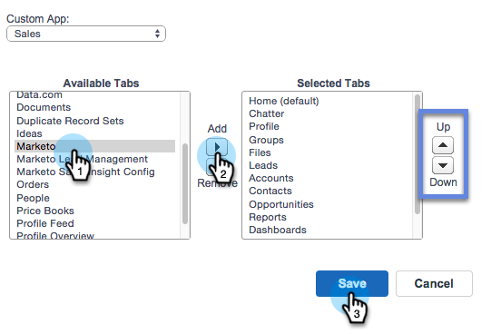
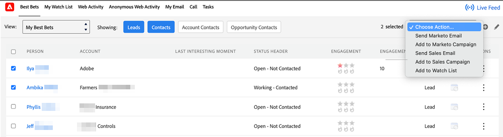

# Agregar la ficha Marketo a [!DNL Salesforce] {#add-marketo-tab-to-salesforce}

1. En [!DNL Salesforce], haga clic en **+** y luego en **[!UICONTROL Personalizar mis fichas]**.

   

1. Seleccione Marketo en la lista de la izquierda. A continuación, haga clic en **[!UICONTROL Agregar]** para agregarlo a las **[!UICONTROL fichas seleccionadas]**.

   >[!TIP]
   >
   >Use las flechas **[!UICONTROL Arriba]** y **[!UICONTROL Abajo]** para reordenar las fichas.

   

   ¡Y aquí está tu pestaña de Marketo!

   
