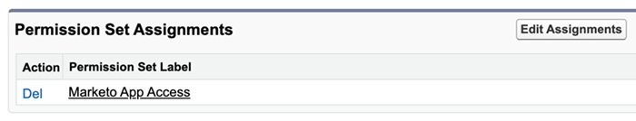

# Agregar conjunto de permisos de Insight de ventas {#add-sales-insight-permission-set}

Siga estos pasos para agregar acceso a las funciones de Perspectiva de ventas en Salesforce. Aplicable a Salesforce Classic y Lighaging

>[!PREREQUISITES]
>
>[Actualizar el paquete de Salesforce de Insight de Ventas](/help/marketo/product-docs/marketo-sales-insight/msi-for-salesforce/upgrading/upgrading-your-msi-package.md){target=&quot;_blank&quot;} a la versión 1.8000 o superior para usar esta función.

>[!IMPORTANT]
>
>Si anteriormente ha dado acceso a la perspectiva de ventas a todos los perfiles o ha implementado la perspectiva de ventas para todos sus usuarios, debe [quitar acceso a nivel de perfil](/help/marketo/product-docs/marketo-sales-insight/msi-for-salesforce/configuration/remove-sales-insight-access.md){target=&quot;_blank&quot;} para usar este conjunto de permisos.

## Resumen {#overview}

El permiso &quot;Aplicación Marketo&quot; forma parte del paquete Sales Insight Salesforce. Incluye acceso a los objetos mencionados a continuación, clases de ápice y páginas de fuerza visual. Son necesarias para acceder a todas las funciones de Perspectiva de ventas.

**Configuración de objetos**

<table> 
 <tbody> 
 <tr> 
   <td>BestBetsCache</td> 
   <td>Leer, Crear, Editar, Eliminar, Ver Todo, Modificar Todo</td> 
  </tr> 
  <tr> 
   <td>Mejores apuestas para ver detalles</td> 
   <td>Leer, Crear, Editar, Eliminar, Ver Todo, Modificar Todo</td> 
  </tr> 
  <tr> 
   <td>Mejores vistas</td> 
   <td>Leer, Crear, Editar, Eliminar, Ver Todo, Modificar Todo</td> 
  </tr> 
  <tr> 
   <td>EmailActivityCache</td> 
   <td>Leer, Crear, Editar, Eliminar, Ver Todo, Modificar Todo</td> 
  </tr> 
  <tr> 
   <td>GetMethodArgus</td> 
   <td>Leer, Crear, Editar, Eliminar, Ver Todo, Modificar Todo</td> 
  </tr> 
  <tr> 
   <td>GroupedWebActivityCache</td> 
   <td>Leer, Crear, Editar, Eliminar, Ver Todo, Modificar Todo</td> 
  </tr> 
  <tr> 
   <td>InterestedMomentsCache</td> 
   <td>Leer, Crear, Editar, Eliminar, Ver Todo, Modificar Todo</td> 
  </tr> 
  <tr> 
   <td>Configuración de perspectiva de ventas de Marketo</td> 
   <td>Leer, Crear, Editar, Eliminar, Ver Todo, Modificar Todo</td> 
  </tr> 
  <tr> 
   <td>ScoringCache</td> 
   <td>Leer, Crear, Editar, Eliminar, Ver Todo, Modificar Todo</td> 
  </tr> 
  <tr> 
   <td>Valores</td> 
   <td>Leer, Crear, Editar, Eliminar, Ver Todo, Modificar Todo</td> 
  </tr> 
  <tr> 
   <td>WebActivityCache</td> 
   <td>Leer, Crear, Editar, Eliminar, Ver Todo, Modificar Todo</td> 
  </tr> 
 </tbody> 
</table>

* Acceso a clase Apex: 159 Clases Apex que están con &quot;mkto_si&quot;
* Acceso a la página de fuerza visual: 64 Páginas de VisualForce que están con &quot;mkto_si&quot;
* Definiciones de configuración personalizadas: Configuración de mkto_si.Marketo y preferencias de usuario de mkto_si

## Adición de un conjunto de permisos de la aplicación Marketo a los usuarios {#adding-marketo-app-permission-set-to-users}

1. Inicie sesión en su cuenta de Salesforce.

1. Haga clic en **Configuración**.

   

1. En Administrador, haga clic en para desplegar **Administrar usuarios**, luego **Usuarios**.

   

1. En Todos los usuarios, seleccione el usuario al que desea proporcionar acceso y, a continuación, haga clic en **Asignaciones de conjuntos de permisos**.

   

1. Haga clic en **Editar asignaciones**.

   

1. Select **Acceso a la aplicación de Marketo** de los conjuntos de permisos disponibles y, a continuación, **Agregar**. Haga clic en **Guardar**.

   

1. Ahora, cuando se desplace hacia abajo por la página Detalles del usuario, verá &quot;Acceso a la aplicación de Marketo&quot; en Asignaciones de conjuntos de permisos.

   

>[!NOTE]
>
>Los usuarios que no tengan acceso a la perspectiva de ventas verán este mensaje: &quot;No tiene suficientes privilegios para acceder a esta pestaña.&quot;

¡Eso es todo! Ha añadido correctamente el acceso a la perspectiva de ventas. Repita los mismos pasos para cualquier otro perfil al que desee agregar acceso.
