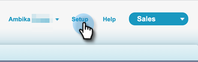

# Agregar conjunto de permisos de [!DNL Sales Insight] {#add-sales-insight-permission-set}

Siga estos pasos para agregar acceso a las características de [!DNL Sales Insight] en [!DNL Salesforce]. Aplicable a [!DNL Salesforce] Classic y Lighening

>[!PREREQUISITES]
>
>[Actualice el paquete [!DNL Sales Insight] [!DNL Salesforce]](/help/marketo/product-docs/marketo-sales-insight/msi-for-salesforce/upgrading/upgrading-your-msi-package.md){target="_blank"} a la versión 1.8000 o superior para usar esta característica.

>[!IMPORTANT]
>
>* Si anteriormente dio acceso a [!DNL Sales Insight] a todos los perfiles o implementó [!DNL Sales Insight] para todos los usuarios, debe [quitar el acceso de nivel de perfil](/help/marketo/product-docs/marketo-sales-insight/msi-for-salesforce/configuration/remove-sales-insight-access.md){target="_blank"} para usar este conjunto de permisos.
>
>* Se requiere la licencia estándar de Salesforce para la funcionalidad completa de MSI. Los usuarios con la licencia de Salesforce Platform (una clase de licencia limitada) pueden ver errores al realizar determinadas acciones o al acceder a algunas pestañas.

## Información general {#overview}

El permiso &quot;Aplicación Marketo&quot; forma parte del paquete [!DNL Sales Insight] [!DNL Salesforce]. Incluye acceso a los objetos mencionados a continuación, clases de Apex y páginas de visualforce. Son necesarios para acceder a todas las características de [!DNL Sales Insight].

**Configuración del objeto**

<table>
 <tbody>
 <tr>
   <td>BestBestCache</td>
   <td>Leer, Crear, Editar, Eliminar, Ver todo, Modificar todo</td>
  </tr>
  <tr>
   <td>Resultados más probables Ver detalles</td>
   <td>Leer, Crear, Editar, Eliminar, Ver todo, Modificar todo</td>
  </tr>
  <tr>
   <td>Vistas de resultados más probables</td>
   <td>Leer, Crear, Editar, Eliminar, Ver todo, Modificar todo</td>
  </tr>
  <tr>
   <td>EmailActivityCache</td>
   <td>Leer, Crear, Editar, Eliminar, Ver todo, Modificar todo</td>
  </tr>
  <tr>
   <td>GetMethodArgus</td>
   <td>Leer, Crear, Editar, Eliminar, Ver todo, Modificar todo</td>
  </tr>
  <tr>
   <td>GroupedWebActivityCache</td>
   <td>Leer, Crear, Editar, Eliminar, Ver todo, Modificar todo</td>
  </tr>
  <tr>
   <td>InterestingMomentsCache</td>
   <td>Leer, Crear, Editar, Eliminar, Ver todo, Modificar todo</td>
  </tr>
  <tr>
   <td>Configuración de Marketo [!DNL Sales Insight]</td>
   <td>Leer, Crear, Editar, Eliminar, Ver todo, Modificar todo</td>
  </tr>
  <tr>
   <td>ScoringCache</td>
   <td>Leer, Crear, Editar, Eliminar, Ver todo, Modificar todo</td>
  </tr>
  <tr>
   <td>Valores</td>
   <td>Leer, Crear, Editar, Eliminar, Ver todo, Modificar todo</td>
  </tr>
  <tr>
   <td>WebActivityCache</td>
   <td>Leer, Crear, Editar, Eliminar, Ver todo, Modificar todo</td>
  </tr>
 </tbody>
</table>

* Acceso a clases Apex: 159 clases Apex que comienzan con &quot;mkto_si&quot;
* Acceso a la página de Visualforce: 64 páginas de Visualforce que comienzan con &quot;mkto_si&quot;
* Definiciones de ajustes personalizados: Configuración de mkto_si.Marketo y Preferencias de mkto_si.User

## Adición del conjunto de permisos de la aplicación Marketo a los usuarios {#adding-marketo-app-permission-set-to-users}

1. Inicie sesión en su cuenta de [!DNL Salesforce].

1. Haga clic en **[!UICONTROL Configuración]**.

   

1. En Administrador, haga clic para mostrar **[!UICONTROL Administrar usuarios]** y luego **[!UICONTROL Usuarios]**.

   

1. En Todos los usuarios, seleccione el usuario al que desee proporcionar acceso y, a continuación, haga clic en **[!UICONTROL Asignaciones de conjuntos de permisos]**.

   

1. Haga clic en **[!UICONTROL Editar asignaciones]**.

   

1. Seleccione **[!UICONTROL Acceso a la aplicación Marketo]** de los conjuntos de permisos disponibles y, a continuación, **[!UICONTROL Agregar]**. Haga clic en **[!UICONTROL Guardar]**.

   

1. Ahora, cuando se desplace hacia abajo por la página Detalles del usuario, verá &quot;Acceso a la aplicación de Marketo&quot; en Asignaciones de conjuntos de permisos.

   

>[!NOTE]
>
>Los usuarios que no tengan acceso a [!DNL Sales Insight] verán este mensaje: &quot;No cuenta con privilegios suficientes para acceder a esta ficha&quot;.

¡Ya está! Ha agregado correctamente el acceso de [!DNL Sales Insight]. Repita los mismos pasos para cualquier otro perfil al que desee agregar acceso.
