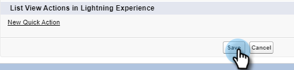

# Acciones masivas en Salesforce Lightning {#bulk-actions-in-salesforce-lightning}

Así es como configurar acciones masivas en Salesforce Lightning.

1. En Salesforce, haga clic en el icono Configuración y seleccione **Configuración**.

   

1. Haga clic en el **Administrador de objetos** pestaña .

   

1. Busque y seleccione el **Posible cliente** etiqueta.

   

1. Haga clic en **Buscar diseños para Salesforce Classic**.

   

   Busque el diseño Vista de lista . Haga clic en la lista desplegable a la derecha y seleccione **Editar**.

   

1. En Botones personalizados , busque y seleccione **Añadir a Marketo Campaign (relámpago)** y **Enviar correo electrónico de Marketo (relámpago)**. Haga clic en el **Agregar** botón.

   

1. Haga clic en **Guardar**.

   

   Ahora podrá ver botones de acción masiva en la vista de lista de posibles clientes.

   >[!NOTE]
   >
   >Repita los mismos pasos para agregar acciones masivas en la vista de lista de contactos.
