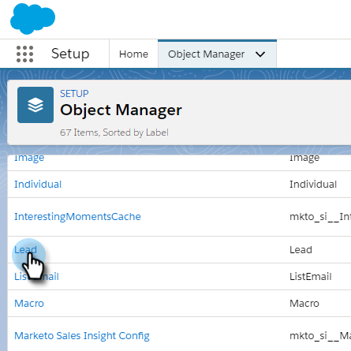

# Acciones masivas en [!DNL Salesforce Lightning] {#bulk-actions-in-salesforce-lightning}

A continuación se indica cómo configurar acciones masivas en [!DNL Salesforce Lightning].

1. En [!DNL Salesforce], haga clic en el icono Configuración y seleccione **[!UICONTROL Configuración]**.

   

1. Haga clic en la ficha **[!UICONTROL Administrador de objetos]**.

   

1. Busque y seleccione la etiqueta **[!UICONTROL Posible cliente]**.

   

1. Haga clic en **[!UICONTROL Buscar diseños de Salesforce Classic]**.

   

   Busque el diseño Vista de lista. Haga clic en el menú desplegable de la derecha y seleccione **[!UICONTROL Editar]**.

   

1. En Botones personalizados, busque y seleccione **[!UICONTROL Agregar a Marketo Campaign (rayo)]** y **[!UICONTROL Enviar correo electrónico de Marketo (rayo)]**. Haga clic en el botón **[!UICONTROL Agregar]**.

   

1. Haga clic en **[!UICONTROL Guardar]**.

   

   Ahora puede ver botones de acción en masa en la vista de lista de posibles clientes.

   >[!NOTE]
   >
   >Repita los mismos pasos para agregar acciones masivas en la vista Lista de contactos.
