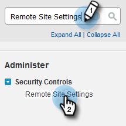

# Configuración para clientes existentes {#configuration-for-existing-customers}

Configure la siguiente configuración para empezar a utilizar el nuevo panel de perspectivas.

>[!PREREQUISITES]
>
>Asegúrese de haber actualizado el paquete [!DNL Salesforce] a la versión más reciente

## Configurar [!DNL Sales Insight] en Marketo {#configure-sales-insight-in-marketo}

1. Abra una ficha nueva en el explorador para obtener las credenciales de [!DNL Marketo Sales Insights] de su cuenta de Marketo.

1. Vaya al área de **[!UICONTROL Admin]**.

   

1. Haga clic en **[!UICONTROL Insight de ventas]**.

   

1. Haga clic en **[!UICONTROL Ver]** para rellenar las credenciales de la API de REST.

   

1. Verá una ventana emergente de confirmación. Haga clic en **[!UICONTROL Aceptar]**.

## Configurar [!DNL Sales Insight] en [!DNL Salesforce] {#configure-sales-insight-in-salesforce}

1. En Salesforce, haga clic en **[!UICONTROL Configuración]**.

   

1. Busque y seleccione **[!UICONTROL Configuración del sitio remoto]**.

   

1. Haga clic en **[!UICONTROL Nuevo sitio remoto]**.

   

1. Escriba el [!UICONTROL Nombre de sitio remoto] (puede ser algo como &quot;MarketoRestAPI&quot;) y la [!UICONTROL URL de sitio remoto] (su URL de API del panel Configuración de API de REST en Marketo).

   

1. Haga clic en **[!UICONTROL Guardar]**.

   

   Ahora ha creado la configuración del sitio remoto para la API de REST.

## Acceder a Sales Insight de Marketo {#access-marketo-sales-insight}

1. Copie las credenciales del panel API de REST en la página de administración [!DNL Marketo’s Sales Insight]. Péguelos en la sección API de REST de la página de configuración de [!DNL Sales Insight] de Salesforce.

1. Escriba la [!UICONTROL clave secreta de la API].

   
