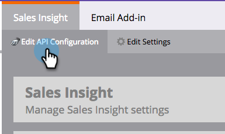

# Configurar la perspectiva de ventas de Marketo en Salesforce Enterprise/Unlimited {#configure-marketo-sales-insight-in-salesforce-enterprise-unlimited}

Estos son los pasos que debe seguir para configurar Marketo Sales Insight en Salesforce Enterprise/Unlimited Editions. Empecemos.

>[!PREREQUISITES]
>
>* [Instalación del paquete de perspectivas de ventas de Marketo en la AppExchange de Salesforce](/help/marketo/product-docs/marketo-sales-insight/msi-for-salesforce/installation/install-marketo-sales-insight-package-in-salesforce-appexchange.md)

>[!NOTE]
**Se requieren permisos de administrador**

## Configurar la perspectiva de ventas en Marketo {#configure-sales-insight-in-marketo}

1. Abra una nueva ventana del explorador para obtener las credenciales de Marketo Sales Insight de su cuenta de Marketo.

1. Vaya al área Administración y seleccione **Perspectiva de ventas**.

   

1. Haga clic en **Editar configuración de API**.

   

1. Escriba una clave secreta de API de su elección y haga clic en **Guardar**. NO use un signo &amp; en la clave secreta de API.

   

   >[!NOTE]
   La clave secreta de API es como una contraseña para su organización y debe ser segura.

1. Haga clic en **Ver** en el panel Configuración de la API restante para rellenar las credenciales.

   

1. Verá una ventana emergente de confirmación. Haga clic en **OK**.

   

## Configurar la perspectiva de ventas en Salesforce {#configure-sales-insight-in-salesforce}

1. En Salesforce, haga clic en **Configuración**.

   

1. Busque &quot;sitio remoto&quot; y seleccione **Configuración de sitio remoto**.

   

1. Haga clic en **Nuevo sitio remoto**.

   

1. Introduzca el Nombre del sitio remoto (puede ser algo así como &quot;MarketoSoapAPI&quot;). Introduzca la URL del sitio remoto, que es su URL de host de Marketo desde el panel Configuración de la API Soap en Marketo. Haga clic en **Guardar**. Ahora ha creado la configuración del sitio remoto para la API de Soap.

   

1. Vuelva a hacer clic en **Nuevo sitio remoto**.

   

1. Introduzca el Nombre del sitio remoto (puede ser algo así como &quot;MarketoRestAPI&quot;). Introduzca la URL del sitio remoto, que es su URL de API del panel Configuración de la API de Rest en Marketo. Haga clic en **Guardar**. Ahora ha creado la configuración del sitio remoto para la API de Rest.

## Configurar Marketo Sales Insight {#set-up-marketo-sales-insight}

1. Inicie sesión en la instancia de Marketo y haga clic en **Admin**.

   

1. Haga clic en **Perspectiva de ventas**.

   

1. Haga clic en **Editar configuración de API**.

   

1. Introduzca una **Clave secreta de API** y haga clic en **Guardar**.

   >[!CAUTION]
   No use un signo &amp; en la clave secreta de API.

   

   >[!TIP]
   Mantenga esta ventana abierta. Necesitará esta información más adelante en Salesforce.

1. Vuelva a Salesforce y haga clic en **Configuración**.

   

1. Busque &quot;sitio remoto&quot; y haga clic en **Configuración de sitio remoto** en **Controles de seguridad**.

   

1. Haga clic en **Nuevo sitio remoto**.

   

1. Introduzca **Remote Site Name** y **Remote Site URL** y, a continuación, haga clic en **Save**.

   

   >[!NOTE]
   Usted elige su **Nombre del sitio remoto** (MarketoAPI se usa aquí). La **URL del sitio remoto** se encuentra en el campo Host de Marketo del cuadro de diálogo Editar configuración de API del paso 4.

## Personalizar diseños de página {#customize-page-layouts}

1. Haga clic en **Configuración**.

   

1. Busque &quot;page layout&quot; y seleccione el **Page Layout** en **Leads**.

   

1. Haga clic en **Visualforce Pages** a la izquierda. Arrastre **Sección** al diseño debajo de la sección Vínculos personalizados .

   

1. Introduzca &quot;Marketo Sales Insight&quot; como **Section Name**. Seleccione **1-Column** y haga clic en **OK**.

   

1. Arrastre y suelte **Lead** en la nueva sección.

   

   >[!TIP]
   El nombre de este cuadro cambiará según el tipo de objeto. Por ejemplo, si está modificando el diseño de página de Contactos, dirá Contacto.

1. Haga doble clic en el bloque **Lead** que acaba de añadir.

   

1. Edite la altura a **450** píxeles y haga clic en **OK**.

   

   >[!TIP]
   Se recomienda una altura de 410 píxeles para los objetos Cuentas y oportunidades .

1. Haga clic en **Fields** a la izquierda. A continuación, busque y arrastre la etiqueta **Participación** al diseño **Perspectiva de ventas de Marketo** .

   

1. Repita el paso anterior también para estos campos.

   <table> 
    <tbody> 
     <tr> 
      <td colspan="1">Compromiso</td> 
     </tr> 
     <tr> 
      <td colspan="1" rowspan="1">
Valor de puntuación relativo
</td> 
     </tr> 
     <tr> 
      <td colspan="1" rowspan="1">
Valor de urgencia
</td> 
     </tr> 
     <tr> 
      <td colspan="1" rowspan="1">
Fecha del último momento interesante
</td> 
     </tr> 
     <tr> 
      <td colspan="1" rowspan="1">
Descripción del último momento interesante
</td> 
     </tr> 
     <tr> 
      <td colspan="1" rowspan="1">
Origen del último momento interesante
</td> 
     </tr> 
     <tr> 
      <td colspan="1" rowspan="1">
Tipo del último momento interesante
</td> 
     </tr> 
    </tbody> 
   </table>

1. Haga clic en **Guardar** cuando termine.

   

1. Repita este proceso para agregar secciones de página de Visualforce y campos de Perspectiva de ventas para **Contacto**, **Cuenta** y **Oportunidad**.

1. Repita los pasos del 5 al 7 para agregar secciones de página de Visualforce para Contacto, Cuenta y Oportunidad. A continuación, repita los pasos 8-10 para agregar campos de perspectiva de ventas para **Contacto**. Asegúrese de guardar después de cualquier cambio.

## Asignar campos de persona personalizados {#map-custom-person-fields}

Los campos de persona de Marketo deben asignarse a los campos de contacto de Salesforce para garantizar que la conversión funcione correctamente. Así es como.

1. Haga clic en **Configuración**.

   

1. Busque &quot;campos&quot; en la barra de búsqueda y haga clic en **Fields** en **Leads**.

   

1. Haga clic en **Asignar campos de posible cliente**.

   

1. Haga clic en el menú desplegable de la derecha para **Participación**.

   

1. Seleccione **Contact.Engagement** en la lista.

   

1. Repita y asigne también estos campos.

   <table> 
    <tbody> 
     <tr> 
      <th colspan="1" rowspan="1">Campo personalizado de persona de Marketo</th> 
      <th colspan="1" rowspan="1">Campo personalizado de contacto de Salesforce</th> 
     </tr> 
     <tr> 
      <td colspan="1" rowspan="1">
Compromiso
</td> 
      <td colspan="1" rowspan="1">
Contact.Engagement
</td> 
     </tr> 
     <tr> 
      <td colspan="1" rowspan="1">
Valor de puntuación relativo
</td> 
      <td colspan="1" rowspan="1">
Valor de puntuación de contacto.relativo
</td> 
     </tr> 
     <tr> 
      <td colspan="1" rowspan="1">
Valor de urgencia
</td> 
      <td colspan="1" rowspan="1">
Valor de Contact.Urgency
</td> 
     </tr> 
     <tr> 
      <td colspan="1" rowspan="1">
Fecha del último momento interesante
</td> 
      <td colspan="1" rowspan="1">
Contact.Última fecha de momento interesante
</td> 
     </tr> 
     <tr> 
      <td colspan="1" rowspan="1">
Descripción del último momento interesante
</td> 
      <td colspan="1" rowspan="1">
Contacto.Último momento interesante Desc
</td> 
     </tr> 
     <tr> 
      <td colspan="1" rowspan="1">
Origen del último momento interesante
</td> 
      <td colspan="1" rowspan="1">
Contacto.Última fuente de momento interesante
</td> 
     </tr> 
     <tr> 
      <td colspan="1" rowspan="1">
Tipo del último momento interesante
</td> 
      <td colspan="1" rowspan="1">
Contacto.Último tipo de momento interesante
</td> 
     </tr> 
    </tbody> 
   </table>

1. Haga clic en **Guardar** cuando haya terminado.

## Configuración de perspectiva de ventas de Marketo {#marketo-sales-insight-config}

1. Haga clic en **+** y, a continuación, seleccione **Marketo Sales Insight Config**.

   

1. Marque **Habilitar la API de Marketo**. A continuación, rellene la información de configuración de la API [en Administración de Marketo](#set-up-marketo-sales-insight). Haga clic en **Guardar cambios** cuando haya terminado.

   

   >[!NOTE]
   Si la prueba de diagnóstico falla, es posible que tenga que [agregar más campos al diseño de página](https://nation.marketo.com/docs/DOC-1115).

¡Y eso es todo! Debería poder ver los campos de Perspectiva de ventas de Marketo para Posibles clientes, Contactos, Cuentas y Oportunidades.

>[!NOTE]
En el caso de las cuentas, Perspectiva de ventas incluirá todos los correos electrónicos, pero solo los momentos interesantes más recientes, la actividad web y los cambios de puntuación.

## Acceso a la perspectiva de ventas de Marketo {#access-marketo-sales-insight}

1. En Salesforce, haga clic en **+** al final de la barra de pestañas y haga clic en **Marketo Sales Insight Config**.

1. Seleccione la casilla **Enable Marketo API**.

1. Copie las credenciales del panel API de Soap en la página de administración de Sales Insight de Marketo y péguelas en la sección API de Soap de la página Configuración de Salesforce Sales Insight .

1. Copie las credenciales del panel de la API Rest en la página de administración de la perspectiva de ventas de Marketo y péguelas en la sección de la API Rest de la página de configuración de la perspectiva de ventas de Salesforce.

   

>[!MORELIKETHIS]
* [Prioridad, urgencia, puntuación relativa y mejores apuestas](/help/marketo/product-docs/marketo-sales-insight/msi-for-salesforce/features/stars-and-flames/priority-urgency-relative-score-and-best-bets.md)
* [Agregar la ficha Perspectiva de ventas de Marketo y los botones a Salesforce](/help/marketo/product-docs/marketo-sales-insight/msi-for-salesforce/features/bulk-actions/add-marketo-sales-insight-tab-and-buttons-to-salesforce.md)
* [Configuración de la perspectiva de ventas para su equipo](/help/marketo/product-docs/marketo-sales-insight/msi-for-salesforce/configuration/setting-up-sales-insight-for-your-team.md)

