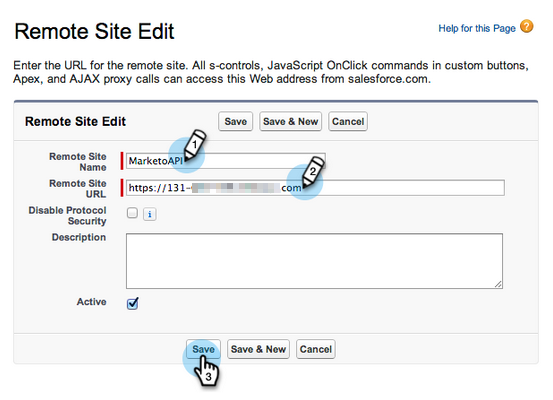

# Configurar [!DNL Marketo Sales Insight] en [!DNL Salesforce] empresa/ilimitado {#configure-marketo-sales-insight-in-salesforce-enterprise-unlimited}

Para configurar Marketo Sales Insight en las ediciones Enterprise/Unlimited de Salesforce, complete los siguientes pasos.

>[!PREREQUISITES]
>
>[Instalar [!DNL Marketo Sales Insight] paquete en [!DNL Salesforce] AppExchange](/help/marketo/product-docs/marketo-sales-insight/msi-for-salesforce/installation/install-marketo-sales-insight-package-in-salesforce-appexchange.md)

>[!NOTE]
>
>Se requieren **permisos de administrador.**

## Configuración de Sales Insight en Marketo Engage {#configure-sales-insight-in-marketo}

1. Para obtener tus credenciales de Marketo Sales Insight en Marketo Engage, ve al área de **[!UICONTROL Admin]** y selecciona **[!UICONTROL Sales Insight]**.

   

1. Haga clic en **[!UICONTROL Editar configuración de API]**.

   

1. Escribe una clave secreta de API que hayas elegido y haz clic en **[!UICONTROL Guardar]**. NO use un signo &amp; (`&`) en la clave secreta de la API.

   

   >[!NOTE]
   >
   >La clave secreta de la API es como una contraseña para su organización y debe ser segura.

1. Para rellenar las credenciales, haga clic en **[!UICONTROL Ver]** en el panel _[!UICONTROL Configuración de la API de REST]_.

   

1. Cuando vea un cuadro de diálogo de confirmación, haga clic en **[!UICONTROL Aceptar]**.

   

   >[!TIP]
   >
   >Mantenga esta ventana abierta. Necesita esta información más adelante para la configuración de Salesforce.

## Configurar [!DNL Sales Insight] en [!DNL Salesforce] {#configure-sales-insight-in-salesforce}

1. En Salesforce, haga clic en **[!UICONTROL Configuración]**.

   

1. Busque &quot;sitio remoto&quot; y seleccione **[!UICONTROL Configuración del sitio remoto]**.

   

1. Haga clic en **[!UICONTROL Nuevo sitio remoto]**.

   

1. Escriba el nombre del sitio remoto (puede ser similar a `MarketoSoapAPI`). Escriba la dirección URL del sitio remoto, que es la dirección URL del host de Marketo desde el panel _[!UICONTROL Configuración de la API de SOAP]_ en Marketo Engage. Haga clic en **[!UICONTROL Guardar]**. Ahora ha creado la configuración del sitio remoto para la API de Soap.

   

1. Vuelva a hacer clic en **[!UICONTROL Nuevo sitio remoto]**.

   

1. Escriba el nombre del sitio remoto (puede ser similar a `MarketoAPI`). Introduzca la URL del sitio remoto, que es la URL de su API desde el panel _[!UICONTROL Configuración de la API de REST]_ en Marketo Engage. Haga clic en **[!UICONTROL Guardar]**. Ahora ha creado la configuración del sitio remoto para la API de REST.

   >[!NOTE]
   >
   >_Usted_ elige **[!UICONTROL Nombre de sitio remoto]** (`MarketoAPI` se usa aquí). La **[!UICONTROL URL del sitio remoto]** se encuentra en el campo Host de Marketo del cuadro de diálogo Editar configuración de API en el paso 3 de la sección &quot;Configuración de Sales Insight en Marketo&quot;.

## Concesión de acceso al perfil de los usuarios de Sales Insight a objetos estándar de Salesforce {#grant-sales-insight-users-profile-access}

Debido a las mejoras de seguridad de Salesforce, los paquetes de AppExchange ya no pueden conceder permiso a objetos estándar y se debe conceder acceso a los objetos de Salesforce relevantes desde el perfil del usuario de Salesforce. Para conceder los permisos necesarios, siga estos pasos.

1. Haga clic en **[!UICONTROL Configuración]**.

1. Buscar &quot;Perfiles&quot; en Búsqueda rápida.

1. Haga clic en **[!UICONTROL Editar]** junto al perfil que están utilizando los usuarios de Salesforce.

1. En la sección _[!UICONTROL Permiso de objeto estándar]_, habilite el acceso de **[!UICONTROL Lectura]** para los objetos siguientes: [!UICONTROL Posible cliente], [!UICONTROL Contacto], [!UICONTROL Cuenta] y [!UICONTROL Oportunidad].

1. Haga clic en **[!UICONTROL Guardar]**.

## Personalizar diseños de página {#customize-page-layouts}

1. Haga clic en **[!UICONTROL Configuración]**.

   

1. Busque &quot;diseño de página&quot; y seleccione **[!UICONTROL Diseño de página]** en **[!UICONTROL Posibles clientes]**.

   

1. Haga clic en **[!UICONTROL Visualforce Pages]** a la izquierda. Arrastre **[!UICONTROL Sección]** al diseño debajo de la sección _[!UICONTROL Vínculos personalizados]_.

   

1. Escriba &quot;Marketo Sales Insight&quot; como **[!UICONTROL Nombre de sección]**, seleccione **[!UICONTROL 1 columna]** y haga clic en **[!UICONTROL Aceptar]**.

   

1. Arrastre y suelte **[!UICONTROL posible cliente]** en la nueva sección.

   

   >[!TIP]
   >
   >El nombre de este cuadro cambia según el tipo de objeto. Por ejemplo, si está modificando el diseño de página de Contactos, se mostrará Contacto.

1. Haga doble clic en el bloque **[!UICONTROL Posible cliente]** que acaba de agregar.

   

1. Edite la altura a **450** píxeles y haga clic en **[!UICONTROL Aceptar]**.

   

   >[!NOTE]
   >
   >Seleccione **[!UICONTROL Mostrar barras de desplazamiento]** si necesita acceso a las actividades de desplazamiento.

   >[!TIP]
   >
   >La altura recomendada para los objetos Cuentas y oportunidades es de 410 píxeles.

1. Haga clic en **[!UICONTROL Campos]** a la izquierda. A continuación, busque y arrastre la etiqueta **[!UICONTROL Urgencia]** al diseño de **[!UICONTROL Marketo Sales Insight]**.

   

1. Repita el paso anterior también para estos campos.

   * Último momento interesante
   * Fecha del último momento interesante
   * Descripción del último momento interesante
   * Origen del último momento interesante
   * Tipo del último momento interesante
   * Última actividad por ventas
   * Último compromiso por ventas
   * ID de contacto MSI
   * Puntaje relativo
   * Valor de puntuación relativa
   * Urgencia
   * Valor de urgencia
   * Ver en Marketo

1. Haga clic en **[!UICONTROL Guardar]** cuando termine.

   

1. Repita los pasos 5-7 para agregar secciones de página de Visualforce y campos de Sales Insight para **[!UICONTROL Contact]**, **[!UICONTROL Account]** y **[!UICONTROL Opportunity]**.

1. Repita los pasos 8-10 para agregar estos campos de Sales Insight para **[!UICONTROL Contact]**. Asegúrese de guardar los cambios.

   * Último momento interesante
   * Fecha del último momento interesante
   * [!UICONTROL Último Momento Interesante Desc]
   * [!UICONTROL Último momento interesante en Source]
   * [!UICONTROL Tipo de último momento interesante]
   * [!UICONTROL Última actividad de Marketo por ventas]
   * [!UICONTROL Última participación de Marketo por parte de ventas]
   * [!UICONTROL Puntuación de posible cliente MKTO]
   * [!UICONTROL Puntuación relativa]
   * [!UICONTROL Valor de puntuación relativa]
   * [!UICONTROL Insight de ventas] - Abre la página de la lista completa de contactos
   * [!UICONTROL Urgencia]
   * [!UICONTROL Valor de urgencia]

## Asignar campos de persona personalizados {#map-custom-person-fields}

Los campos de persona de Marketo deben asignarse a los campos de contacto de Salesforce para garantizar que la conversión funcione correctamente. Siga estos pasos para asignarlos.

1. Haga clic en **[!UICONTROL Configuración]**.

   

1. Busque &quot;campos&quot; en la barra de búsqueda y haga clic en **[!UICONTROL Campos]** en **[!UICONTROL Posibles clientes]**.

   

1. Haga clic en **[!UICONTROL Asignar campos de posibles clientes]**.

   

1. Haga clic en el menú desplegable de la derecha de **[!UICONTROL Participación]**.

   

1. Seleccione **[!UICONTROL Contact.Engagement]** en la lista.

   

1. Repita y asigne también estos campos.

   | Campo personalizado de persona de Marketo | Campo personalizado de contacto de Salesforce |
   |--- |--- |
   | `Engagement` | `Contact.Engagement` |
   | `Relative Score Value` | `Contact.Relative Score Value` |
   | `Urgency Value` | `Contact.Urgency Value` |
   | `Last Interesting Moment Date` | `Contact.Last Interesting Moment Date` |
   | `Last Interesting Moment Desc` | `Contact.Last Interesting Moment Desc` |
   | `Last Interesting Moment Source` | `Contact.Last Interesting Moment Source` |
   | `Last Interesting Moment Type` | `Contact.Last Interesting Moment Type` |

1. Haz clic en **[!UICONTROL Guardar]** cuando hayas terminado.

## Pestaña Configuración de Marketo Sales Insight {#marketo-sales-insight-configuration-tab}

1. En Salesforce, haga clic en **+** al final de la barra de pestañas y luego en **[!UICONTROL Configuración de Marketo Sales Insight]**.

1. Copie las credenciales del panel API de Soap en la [página de administración de Sales Insight de Marketo](/help/marketo/product-docs/marketo-sales-insight/msi-for-salesforce/configuration/configure-marketo-sales-insight-in-salesforce-professional-edition.md#set-up-marketo-sales-insight){target="_blank"} y péguelas en la sección de la API de Soap de la página de configuración de [!DNL Salesforce] [!DNL Sales Insight].

1. Copie las credenciales del panel de API de REST en la [página de administración de Sales Insight de Marketo](/help/marketo/product-docs/marketo-sales-insight/msi-for-salesforce/configuration/configure-marketo-sales-insight-in-salesforce-professional-edition.md#set-up-marketo-sales-insight){target="_blank"} y péguelas en la sección de API de REST de la página de configuración de [!DNL Salesforce] [!DNL Sales Insight].

   

Debería poder ver los campos de Marketo Sales Insight para posibles clientes, contactos, cuentas y oportunidades.

>[!NOTE]
>
>Si la prueba de diagnóstico falla, [agregar más campos al diseño de página](https://nation.marketo.com:443/t5/knowledgebase/how-to-repair-marketo-sales-insight-setup-configuration-problems/ta-p/248218){target="_blank"} podría solucionar el problema.

>[!NOTE]
>
>En el caso de las cuentas, Sales Insight incluye todos los correos electrónicos, pero solo los momentos interesantes más recientes, la actividad web y los cambios de puntuación.

>[!MORELIKETHIS]
>
>* [Prioridad, urgencia, puntuación relativa y elementos más probables](/help/marketo/product-docs/marketo-sales-insight/msi-for-salesforce/features/stars-and-flames/priority-urgency-relative-score-and-best-bets.md)
>* [Agregar ficha de Marketo a [!DNL Salesforce]](/help/marketo/product-docs/marketo-sales-insight/msi-for-salesforce/configuration/add-marketo-tab-to-salesforce.md)
>* [Agregar acceso de Insight de ventas a perfiles](/help/marketo/product-docs/marketo-sales-insight/msi-for-salesforce/configuration/add-sales-insight-access-to-profiles.md){target="_blank"}
