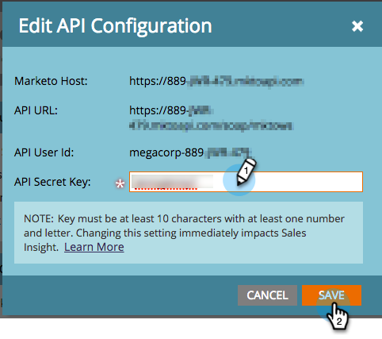

# Configuración de Marketo Sales Insight en Salesforce Professional Edition {#configure-marketo-sales-insight-in-salesforce-professional-edition}

Estos son los pasos que debe seguir para configurar Marketo Sales Insight en Salesforce Professional Edition. Comencemos.

>[!PREREQUISITES]
>
>* Instale Marketo en su Salesforce Professional Edition.
>
>* [Instalación del paquete de información de ventas de Marketo en la AppExchange de Salesforce](/help/marketo/product-docs/marketo-sales-insight/msi-for-salesforce/installation/install-marketo-sales-insight-package-in-salesforce-appexchange.md){target="_blank"}

>[!NOTE]
>
>**Permisos de administración necesarios**

## Configuración de Sales Insight en Marketo {#configure-sales-insight-in-marketo}

1. Abra una nueva ventana del explorador para obtener las credenciales de Marketo Sales Insight de su cuenta de Marketo.
1. Vaya al área de Administración y seleccione **Perspectiva de ventas**.

   

1. Clic **Editar configuración de API**.

   

1. Introduzca una clave secreta de API de su elección y haga clic en **Guardar**. NO use el signo &amp; en la clave secreta de la API.

   

   >[!NOTE]
   >
   >La clave secreta de la API es como una contraseña para su organización y debe ser segura.

1. Clic **Ver** en el panel Configuración de la API de REST para rellenar las credenciales.

   

1. Verá una ventana emergente de confirmación. Clic **OK**.

   

## Configuración de Sales Insight en Salesforce {#configure-sales-insight-in-salesforce}

1. En Salesforce, haga clic **Configurar**.

   

1. Busque &quot;sitio remoto&quot; y seleccione **Configuración del sitio remoto**.

   

1. Clic **Nuevo sitio remoto**.

   

1. Introduzca el nombre del sitio remoto (puede ser algo como &quot;MarketoSoapAPI&quot;). Introduzca la URL del sitio remoto, que es la URL del host de Marketo desde el panel Configuración de la API de SOAP en Marketo. Clic **Guardar**. Ahora ha creado la configuración del sitio remoto para la API de Soap.

   

1. Clic **Nuevo sitio remoto** otra vez.

   

1. Introduzca el nombre del sitio remoto (puede ser algo como &quot;MarketoRestAPI&quot;). Introduzca la URL del sitio remoto, que es la URL de la API desde el panel Configuración de la API de REST en Marketo. Clic **Guardar**. Ahora ha creado la configuración del sitio remoto para la API de REST.

## Configuración de Marketo Sales Insight {#set-up-marketo-sales-insight}

1. Inicie sesión en la instancia de Marketo y haga clic en **Administrador**.

   

1. Clic **Perspectiva de ventas**.

   

1. Clic **Editar configuración de API**.

   

1. Introduzca una **Clave secreta de API** y haga clic en **Guardar**.

   >[!CAUTION]
   >
   >No use el signo &amp; en la clave secreta de la API.

   

   >[!TIP]
   >
   >Mantenga esta ventana abierta. Necesitará esta información más adelante en Salesforce.

1. Vuelva a Salesforce y haga clic en **Configurar**.

   

1. Busque &quot;sitio remoto&quot; y haga clic en **Configuración del sitio remoto** bajo **Controles de seguridad**.

   

1. Clic **Nuevo sitio remoto**.

   

1. Entrar **Nombre de sitio remoto** y **URL del sitio remoto**, luego haga clic en **Guardar**.

   

   >[!NOTE]
   >
   >Usted elige su **Nombre de sitio remoto** (La API de Marketo se utiliza aquí). El **URL del sitio remoto** se encuentra en el campo Host de Marketo del cuadro de diálogo Editar configuración de API del paso 4.

## Personalizar diseños de página {#customize-page-layouts}

1. Clic **Configurar**.

   

1. Busque &quot;diseño de página&quot; y seleccione **Diseño de página** bajo **Posibles clientes**.

   

1. Clic **Visualforce Pages** a la izquierda. Arrastrar **Sección** al diseño debajo de la sección Vínculos personalizados.

   

1. Introduzca &quot;Marketo Sales Insight&quot; como **Nombre de sección**. Seleccionar **1 columna** y haga clic en **OK**.

   

1. Arrastrar y soltar **Posible cliente** en la nueva sección.

   

   >[!TIP]
   >
   >El nombre de este cuadro cambiará en función del tipo de objeto. Por ejemplo, si está modificando el diseño de página para Contactos, indicará Contacto.

1. Haga doble clic en **Posible cliente** que acaba de agregar.

   

1. Editar altura a **450** píxeles y clic **OK**.

   

   >[!NOTE]
   >
   >Marque **Mostrar barras de desplazamiento** si necesita acceso a las actividades de desplazamiento.

   >[!TIP]
   >
   >Se recomienda una altura de 410 píxeles para los objetos Accounts y Opportunity.

1. Haga clic en **Campos** a la izquierda. A continuación, busque y arrastre el **Participación** etiqueta en el **Perspectiva de ventas de Marketo** diseño.

   

1. Repita el paso anterior también para estos campos.

<table> 
 <tbody> 
  <tr> 
   <td colspan="1">Participación</td> 
  </tr> 
  <tr> 
   <td colspan="1" rowspan="1">
Valor de puntuación relativa
</td> 
  </tr> 
  <tr> 
   <td colspan="1" rowspan="1">
Valor de urgencia
</td> 
  </tr> 
  <tr> 
   <td colspan="1" rowspan="1">
Fecha del último momento interesante
</td> 
  </tr> 
  <tr> 
   <td colspan="1" rowspan="1">
Descripción del último momento interesante
</td> 
  </tr> 
  <tr> 
   <td colspan="1" rowspan="1">
Origen del último momento interesante
</td> 
  </tr> 
  <tr> 
   <td colspan="1" rowspan="1">
Tipo del último momento interesante
</td> 
  </tr> 
 </tbody> 
</table>

1. Clic **Guardar** cuando termine.

   

1. Repita este proceso para añadir secciones de página de Visualforce y campos de perspectiva de ventas para **Contacto**, **Cuenta** y **Oportunidad**.
1. Repita los pasos 5-7 para agregar secciones de página de Visualforce para Contacto, Cuenta y Oportunidad. A continuación, repita los pasos 8-10 para añadir los campos de Perspectiva de ventas para **Contacto**. Asegúrese de guardar después de realizar cualquier cambio.

## Asignar campos de persona personalizados {#map-custom-person-fields}

Los campos de persona de Marketo deben asignarse a los campos de contacto de Salesforce para garantizar que la conversión funcione correctamente. Así es como.

1. Clic **Configurar**.

   

1. Busque &quot;campos&quot; en la barra de búsqueda y haga clic en **Campos** bajo **Posibles clientes**.

   

1. Clic **Asignar campos de posibles clientes**.

   

1. Haga clic en el menú desplegable de la derecha para **Participación**.

   

1. Seleccionar **Contact.Engagement** en la lista.

   

1. Repita y asigne también estos campos.

<table> 
 <tbody> 
  <tr> 
   <th colspan="1" rowspan="1">Campo personalizado de persona de Marketo</th> 
   <th colspan="1" rowspan="1">Campo personalizado de contacto de Salesforce</th> 
  </tr> 
  <tr> 
   <td colspan="1" rowspan="1">
Participación
</td> 
   <td colspan="1" rowspan="1">
Contact.Engagement
</td> 
  </tr> 
  <tr> 
   <td colspan="1" rowspan="1">
Valor de puntuación relativa
</td> 
   <td colspan="1" rowspan="1">
Contact.Relative Score Value
</td> 
  </tr> 
  <tr> 
   <td colspan="1" rowspan="1">
Valor de urgencia
</td> 
   <td colspan="1" rowspan="1">
Valor Contact.Urgency
</td> 
  </tr> 
  <tr> 
   <td colspan="1" rowspan="1">
Fecha del último momento interesante
</td> 
   <td colspan="1" rowspan="1">
Contacto.Fecha del último momento interesante
</td> 
  </tr> 
  <tr> 
   <td colspan="1" rowspan="1">
Descripción del último momento interesante
</td> 
   <td colspan="1" rowspan="1">
Contacto.Último momento interesante Desc
</td> 
  </tr> 
  <tr> 
   <td colspan="1" rowspan="1">
Origen del último momento interesante
</td> 
   <td colspan="1" rowspan="1">
Contacto.Último momento interesante origen
</td> 
  </tr> 
  <tr> 
   <td colspan="1" rowspan="1">
Tipo del último momento interesante
</td> 
   <td colspan="1" rowspan="1">
Contacto.Último tipo de momento interesante
</td> 
  </tr> 
 </tbody> 
</table>

1. Clic **Guardar** cuando haya terminado.

   

## Pestaña Configuración de Marketo Sales Insight {#marketo-sales-insight-configuration-tab}

1. En Salesforce, haga clic en **+** al final de la barra de pestañas y haga clic en **Configuración de Marketo Sales Insight**.

1. Copie las credenciales del panel API de Soap en [Página de administración de Sales Insight de Marketo](/help/marketo/product-docs/marketo-sales-insight/msi-for-salesforce/configuration/configure-marketo-sales-insight-in-salesforce-professional-edition.md#set-up-marketo-sales-insight){target="_blank"} y péguelos en la sección API de Soap de la página Configuración de Sales Insight de Salesforce.

1. Copie las credenciales del panel API de REST en [Página de administración de Sales Insight de Marketo](/help/marketo/product-docs/marketo-sales-insight/msi-for-salesforce/configuration/configure-marketo-sales-insight-in-salesforce-professional-edition.md#set-up-marketo-sales-insight){target="_blank"} y péguelos en la sección API de REST de la página Configuración de Sales Insight de Salesforce.

   

¡Y eso es todo! Debería poder ver los campos de perspectiva de ventas de Marketo para posibles clientes, contactos, cuentas y oportunidades.

>[!NOTE]
>
>Si la prueba de diagnóstico falla, es posible que tenga que [agregar más campos al diseño de página](https://nation.marketo.com/docs/DOC-1115){target="_blank"}.

>[!NOTE]
>
>En el caso de las cuentas, Sales Insight incluirá todos los correos electrónicos, pero solo los momentos interesantes más recientes, la actividad web y los cambios de puntuación.

>[!MORELIKETHIS]
>
>* [Prioridad, urgencia, puntuación relativa y resultados más probables](/help/marketo/product-docs/marketo-sales-insight/msi-for-salesforce/features/stars-and-flames/priority-urgency-relative-score-and-best-bets.md){target="_blank"}
>* [Añadir la pestaña Marketo a Salesforce](/help/marketo/product-docs/marketo-sales-insight/msi-for-salesforce/configuration/add-marketo-tab-to-salesforce.md){target="_blank"}
>* [Añadir el acceso de Sales Insight a los perfiles](/help/marketo/product-docs/marketo-sales-insight/msi-for-salesforce/configuration/add-sales-insight-access-to-profiles.md){target="_blank"}
