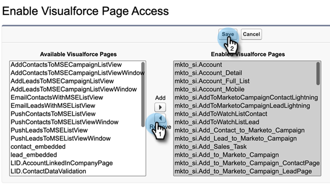

# Eliminar acceso a perspectivas de ventas {#remove-sales-insight-access}

Siga estos pasos para eliminar el acceso a las funciones de Perspectiva de ventas en Salesforce. Aplicable a Salesforce Classic y Lightning.

## Resumen {#overview}

Se requiere permiso para acceder a todos los objetos mencionados a continuación, clases de ápice y páginas de visualforce para acceder a todas las funciones de perspectivas de ventas. Si se eliminan, se eliminará el acceso a la perspectiva de ventas.

**Configuración de objetos**

<table> 
 <tbody> 
 <tr> 
   <td>BestBetsCache</td> 
   <td>Leer, Crear, Editar, Eliminar, Ver Todo, Modificar Todo</td> 
  </tr> 
  <tr> 
   <td>Mejores apuestas para ver detalles</td> 
   <td>Leer, Crear, Editar, Eliminar, Ver Todo, Modificar Todo</td> 
  </tr> 
  <tr> 
   <td>Mejores vistas</td> 
   <td>Leer, Crear, Editar, Eliminar, Ver Todo, Modificar Todo</td> 
  </tr> 
  <tr> 
   <td>EmailActivityCache</td> 
   <td>Leer, Crear, Editar, Eliminar, Ver Todo, Modificar Todo</td> 
  </tr> 
  <tr> 
   <td>GetMethodArgus</td> 
   <td>Leer, Crear, Editar, Eliminar, Ver Todo, Modificar Todo</td> 
  </tr> 
  <tr> 
   <td>GroupedWebActivityCache</td> 
   <td>Leer, Crear, Editar, Eliminar, Ver Todo, Modificar Todo</td> 
  </tr> 
  <tr> 
   <td>InterestedMomentsCache</td> 
   <td>Leer, Crear, Editar, Eliminar, Ver Todo, Modificar Todo</td> 
  </tr> 
  <tr> 
   <td>Configuración de perspectiva de ventas de Marketo</td> 
   <td>Leer, Crear, Editar, Eliminar, Ver Todo, Modificar Todo</td> 
  </tr> 
  <tr> 
   <td>ScoringCache</td> 
   <td>Leer, Crear, Editar, Eliminar, Ver Todo, Modificar Todo</td> 
  </tr> 
  <tr> 
   <td>Valores</td> 
   <td>Leer, Crear, Editar, Eliminar, Ver Todo, Modificar Todo</td> 
  </tr> 
  <tr> 
   <td>WebActivityCache</td> 
   <td>Leer, Crear, Editar, Eliminar, Ver Todo, Modificar Todo</td> 
  </tr> 
 </tbody> 
</table>

* Acceso a clase Apex: 159 Clases Apex que están con &quot;mkto_si&quot;
* Acceso a la página de fuerza visual: 64 Páginas de VisualForce que están con &quot;mkto_si&quot;
* Definiciones de configuración personalizadas: Configuración de mkto_si.Marketo y preferencias de usuario de mkto_si

## Eliminación del acceso a la perspectiva de ventas {#removing-access-to-sales-insight}

1. Inicie sesión en su cuenta de Salesforce.

1. Haga clic en **Configuración**.

   

1. En Administrador, haga clic en **Administrar usuarios**, luego **Perfiles**.

1. Haga clic en el perfil que desee actualizar y luego **Editar**.

1. Desplácese hacia abajo hasta &quot;Configuración de tabulación personalizada&quot; en Configuración de tabulación.

1. Seleccione la opción &quot;Tabulador oculto&quot; en la lista desplegable de Configuración de la perspectiva de ventas de Marketo y Bandeja de salida de ventas de MSI Marketo.

   

   

1. Desplácese hacia abajo hasta &quot;Permisos de objeto personalizados&quot;.

1. Elimine el acceso &quot;Leer, Crear, Editar, Eliminar&quot; de los siguientes objetos:

   * BestBetsCache
   * Mejores apuestas para ver detalles
   * Mejores vistas
   * EmailActivityCache
   * GetMethodArgus
   * GroupedWebActivityCache
   * InterestedMomentsCache
   * Configuración de perspectiva de ventas de Marketo
   * ScoringCache
   * Valores
   * WebActivityCache

1. Desplácese hacia abajo hasta la sección &quot;Acceso de clase Apex habilitado&quot;. Haga clic en **Editar**.

1. En la sección &quot;Clases Apex Habilitadas&quot;, seleccione todas las clases que empiecen por &quot;mkto_si&quot;. Esto debería sumar hasta 159 clases.

1. Haga clic en **Eliminar**, luego **Guardar**.

   

1. Desplácese hacia abajo hasta la sección &quot;Acceso a página de fuerza visual habilitado&quot;. Haga clic en **Editar**.

1. En la sección &quot;Páginas de fuerza visual habilitadas&quot;, seleccione todas las páginas que empiecen por &quot;mkto_si&quot;. Debería añadir hasta 64 páginas.

1. Haga clic en **Eliminar**, luego **Guardar**.

   

1. Desplácese hacia abajo hasta la sección &quot;Acceso a definiciones de configuración personalizada habilitado&quot;. Haga clic en **Editar**.

1. Seleccione &quot;Marketo Sales Insight.mkto_si.Marketo Settings&quot; y &quot;Marketo Sales Insight.mkto_si.User Preferences&quot;.

1. Haga clic en **Eliminar**, luego **Guardar**.

   

¡Eso es todo! Ha eliminado correctamente el acceso a la perspectiva de ventas. Repita los mismos pasos para cualquier otro perfil para el que desee eliminar el acceso.
