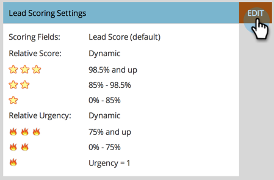

# Página de perspectiva de ventas para administradores de mercadotecnia {#sales-insight-page-for-marketo-admins}

Los administradores de mercadotecnia tienen ciertos privilegios en Sales Insight. Aprenda lo que son a continuación.

## Configuración de API de Soap {#soap-api-configuration}

Estas credenciales se utilizan para conectar la cuenta de Salesforce a la instancia de Marketing, a fin de utilizar MSI en Salesforce.

## Configuración de API de Rest {#rest-api-configuration}

Estas credenciales se utilizan para conectar la cuenta de Salesforce a la instancia de Marketing, a fin de utilizar el Panel de perspectivas MSI en Salesforce.

Puede optar por eliminar las credenciales de API de Rest en SFDC y utilizar solo las API de Soap. Esto deshabilitará el Panel de perspectivas

## Configuración de puntuación de persona {#person-score-settings}

* **Estrellas**: Las estrellas representan la puntuación total de posibles clientes en comparación con otros posibles clientes.
* **Flames**: Las llamas representan una urgencia: cuánto ha cambiado recientemente la puntuación de un posible cliente.

De forma predeterminada, Marketo Sales Insight utiliza el campo Puntuación de posible cliente para calcular estrellas y llamas. Pero si quieres elegir un campo diferente, así es como:

1. En el área **Administración** de Marketing, haga clic en **Perspectiva de ventas**.

   

1. En Configuración de puntuación de posibles clientes, haga clic en **Editar**.

   

1. Seleccione el campo que desee utilizar para las estrellas.

   

1. Seleccione el campo que desee utilizar para las llamas.

   

1. Haga clic en **Guardar**. La perspectiva de ventas tardará algún tiempo en volver a calcularse. Puede consultar su CRM más tarde para ver las estrellas y las llamas.

   

   >[!TIP]
   >
   >Si aún no tiene los campos de puntuación personalizados, puede [crearlos](/help/marketo/product-docs/administration/field-management/create-a-custom-field-in-marketo.md).

   >[!MORELIKETHIS]
   >
   >[Estrellas y llamas](/help/marketo/product-docs/marketo-sales-insight/msi-for-salesforce/features/stars-and-flames/customize-stars-and-flames.md)

## Configuración {#settings}

**Cancelar suscripción de configuración:**

Puede elegir entre los siguientes ajustes de cancelación de suscripción para Sin plantilla, Correos electrónicos estándar y Correos electrónicos operativos

* Respetar configuración de cancelación de suscripción
* Respetar la configuración de cancelación de suscripción cuando más de 1 destinatario
* Respetar la configuración de cancelación de suscripción cuando más de 5 destinatarios
* Ignorar configuración de cancelación de suscripción

**Habilitar la capacidad de bloquear plantillas:**

Cuando se habilita, los usuarios de MSI no podrán editar plantillas al enviar correos electrónicos desde Salesforce

**Habilitar fuente RSS:**

Cuando está habilitada, los usuarios de MSI pueden vista su fuente de posibles clientes en una fuente RSS (además de la fuente de posibles clientes en Salesforce).
