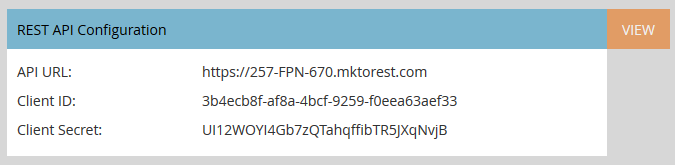

# [!DNL Sales Insight] página para administradores de Marketo {#sales-insight-page-for-marketo-admins}

Los administradores de Marketo tienen ciertos privilegios en [!DNL Sales Insight]. Descubra cuáles son a continuación.

## Configuración de API de SOAP {#soap-api-configuration}

Estas credenciales se usan para conectar su cuenta de [!DNL Salesforce] a su instancia de Marketo para usar MSI en [!DNL Salesforce].

## Configuración de API de REST {#rest-api-configuration}

Estas credenciales se usan para conectar su cuenta de [!DNL Salesforce] a su instancia de Marketo, con el fin de usar el panel de información de MSI en [!DNL Salesforce].

## Configuración de puntuación de persona {#person-score-settings}

* **[!UICONTROL Estrellas]**: Las estrellas representan la puntuación total del posible cliente en comparación con otros posibles clientes.
* **[!UICONTROL Llamas]**: Las llamas representan urgencia, cuánto ha cambiado recientemente la puntuación de un posible cliente.

De manera predeterminada, [!DNL Marketo Sales Insight] usa el campo Puntuación de posibles clientes para calcular las estrellas y las llamas. Pero si desea elegir un campo diferente, así es como:

1. En el área **[!UICONTROL Administrador]** de Marketo, haga clic en **[!UICONTROL Insight de ventas]**.

   

1. En [!UICONTROL Configuración de puntuación de posibles clientes], haga clic en **[!UICONTROL Editar]**.

   

1. Seleccione el campo que desee utilizar para las estrellas.

   

1. Seleccione el campo que desee utilizar para las llamas.

   

1. Haga clic en **[!UICONTROL Guardar]**. Sales insight tardará algún tiempo en volver a calcular. Puede comprobar su CRM más tarde para ver las estrellas y las llamas.

   

   >[!TIP]
   >
   >Si aún no tienes tus campos de puntuación personalizados, así es como [crearlos](/help/marketo/product-docs/administration/field-management/create-a-custom-field-in-marketo.md).

   >[!MORELIKETHIS]
   >
   >[Estrellas y llamas](/help/marketo/product-docs/marketo-sales-insight/msi-for-salesforce/features/stars-and-flames/customize-stars-and-flames.md)

## Configuración {#settings}

**Configuración de cancelación de suscripción:**

Puede elegir la siguiente configuración para cancelar la suscripción a [!UICONTROL Sin plantilla], [!UICONTROL correos electrónicos estándar] y [!UICONTROL correos electrónicos operativos]

* [!UICONTROL Respetar configuración de cancelación de suscripción]
* [!UICONTROL Respetar configuración de cancelación de suscripción cuando más de 1 destinatario]
* [!UICONTROL Respetar la configuración de cancelación de suscripción cuando más de 5 destinatarios]
* [!UICONTROL Omitir configuración de cancelación de suscripción]

**Habilitar la capacidad para bloquear plantillas:**

Cuando se habilita, los usuarios de MSI no podrán editar las plantillas al enviar correos electrónicos desde [!DNL Salesforce]

**Habilitar fuente RSS:**

Cuando está habilitada, los usuarios de MSI pueden ver su fuente de posibles clientes en una fuente RSS (además de la fuente de posibles clientes de [!DNL Salesforce]). La fuente RSS solo puede funcionar si la característica &quot;[!UICONTROL Caducidad del token]&quot; está deshabilitada.

**Caducidad del token:**

La caducidad del token se controla en el Administrador de funciones. Para habilitarlo o deshabilitarlo, comuníquese con [Soporte técnico de Marketo](https://nation.marketo.com/t5/Support/ct-p/Support). Cuando se habilita, todos los tokens de Marketo caducan en un plazo de 10 minutos. Cuando está desactivado, los tokens de Marketo no caducan.

Los tokens generados antes de habilitar la caducidad del token no tendrán una hora de caducidad con la que validarse, por lo que no caducarán aunque la función esté habilitada actualmente.

Los tokens generados después de habilitar la caducidad del token tendrán un tiempo de caducidad de 10 minutos, por lo que caducarán en 10 minutos incluso después de que la función esté deshabilitada.

El comportamiento del token se basará en el momento en que se generó (cuando la función de caducidad del token estaba habilitada/deshabilitada, en lugar de su estado actual).
