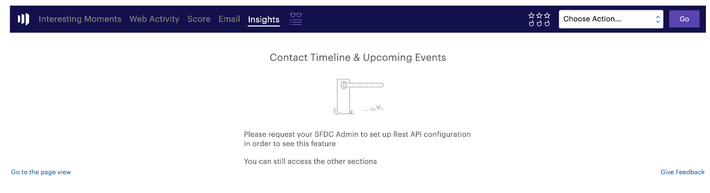

# Página Perspectiva de Ventas para Administradores de Marketo {#sales-insight-page-for-marketo-admins}

Los administradores de Marketo tienen ciertos privilegios en Sales Insight. Aprenda lo que son a continuación.

## Configuración de API Soap {#soap-api-configuration}

Estas credenciales se utilizan para conectar su cuenta de Salesforce a la instancia de Marketo, con el fin de utilizar MSI en Salesforce.

## Configuración de API de Rest {#rest-api-configuration}

Estas credenciales se utilizan para conectar la cuenta de Salesforce a la instancia de Marketo con el fin de utilizar el panel de información de MSI en Salesforce.

Puede optar por eliminar las credenciales de API de Rest en SFDC y utilizar solo las API de Soap. Esto deshabilitará el panel de perspectivas

## Configuración de puntuación de persona {#person-score-settings}

* **Estrellas**: Las estrellas representan la puntuación total de posibles clientes en comparación con otros posibles clientes.
* **Flores**: Las llamas representan urgencia -cuánto ha cambiado recientemente la puntuación de un plomo-.

De forma predeterminada, Marketo Sales Insight utiliza el campo Puntuación de posible cliente para calcular estrellas y llamas. Pero si desea elegir un campo diferente, así es como:

1. En el área **Administración** de Marketo, haga clic en **Perspectiva de ventas**.

   

1. En Configuración de puntuación de posibles clientes, haga clic en **Editar**.

   

1. Seleccione el campo que desee utilizar para las estrellas.

   

1. Seleccione el campo que desee utilizar para las llamas.

   

1. Haga clic en **Guardar**. La perspectiva de ventas tardará algún tiempo en volver a calcularse. Puede comprobar su CRM más tarde para ver las estrellas y las llamas.

   

   >[!TIP]
   >
   >Si aún no tiene los campos de puntuación personalizados, así es como [crearlos](/help/marketo/product-docs/administration/field-management/create-a-custom-field-in-marketo.md).

   >[!MORELIKETHIS]
   >
   >[Estrellas y llamas](/help/marketo/product-docs/marketo-sales-insight/msi-for-salesforce/features/stars-and-flames/customize-stars-and-flames.md)

## Configuración {#settings}

**Cancelar suscripción:**

Puede elegir entre las siguientes opciones para cancelar la suscripción sin plantilla, correos electrónicos estándar y correos electrónicos operativos

* Configuración de cancelación de suscripción de respeto
* Respetar la configuración de cancelación de suscripción cuando más de un destinatario
* Respetar la configuración de cancelación de suscripción cuando más de 5 destinatarios
* Ignorar configuración de cancelación de suscripción

**Habilitar la capacidad de bloquear plantillas:**

Cuando se habilita, los usuarios de MSI no podrán editar plantillas al enviar correos electrónicos desde Salesforce

**Habilitar fuente RSS:**

Cuando está habilitado, los usuarios de MSI pueden ver su Fuente de posibles clientes en una fuente RSS (además de la Fuente de posibles clientes en Salesforce). La fuente RSS solo puede funcionar si la función &quot;Caducidad del token&quot; está deshabilitada.

**Caducidad del token:**

La caducidad del token se controla en el Administrador de funciones. Para habilitarlo o deshabilitarlo, póngase en contacto con [Compatibilidad con Marketo](https://nation.marketo.com/t5/Support/ct-p/Support). Cuando está habilitado, todos los tokens de Marketo caducan en 10 minutos. Cuando está desactivado, los tokens de Marketo no caducan.

Los tokens generados antes de activar la caducidad del token no tendrán un tiempo de caducidad para la validación, por lo que no caducarán aunque la función esté habilitada actualmente.

Los tokens generados después de habilitar la caducidad del token tendrán un tiempo de caducidad de 10 minutos, por lo que caducarán en 10 minutos incluso después de que la función esté deshabilitada.

El comportamiento del token se basará en el momento en que se generó (cuando la función Caducidad del token se habilitó o deshabilitó, en lugar de su estado de función actual).
