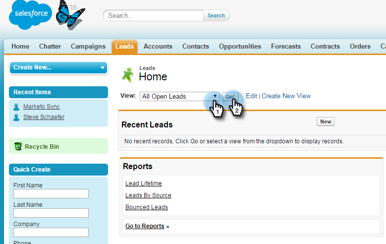

# Añadir un posible cliente/contacto a una Campaña de marketing de Salesforce {#add-a-lead-contact-to-a-marketo-campaign-from-salesforce}

Puede agregar fácilmente leads o contactos a campañas inteligentes de Marketing to desde Salesforce. Así es como usar leads.

1. En Salesforce, haga clic en la ficha **Posibles clientes**.

   

1. Seleccione la lista de las personas a las que desea realizar la vista en la lista desplegable y haga clic en **Ir**.

   

   >[!NOTE]
   >
   >La lista de selección de la lista desplegable incluye Todos los leads abiertos o Posibles clientes no leídos, Posibles clientes vistos recientemente, Posibles clientes de hoy y puede incluir otras categorías.

1. Seleccione un lead de la lista para abrir el registro.

   

1. En el registro, desplácese hacia abajo hasta el área de perspectiva de ventas de Marketing to, haga clic en la lista desplegable **Acciones**, seleccione **Añadir a Campaña de marketing** y haga clic en **Ir**.

   

1. Haga clic en la lista desplegable **Nombre de la Campaña**, seleccione la campaña de marketing que desee y haga clic en **Añadir a la Campaña de marketing**.

   

   >[!NOTE]
   >
   >Para que la campaña aparezca en la lista desplegable, utilice el déclencheur [**Campaña se solicita**](/help/marketo/product-docs/core-marketo-concepts/smart-campaigns/using-smart-campaigns/setting-up-a-trigger-smart-campaign-for-sales-using-campaign-is-requested.md), con **perspectiva de ventas** como fuente, cuando configure la campaña.

¡Y eso es todo! La persona se agrega a la campaña de marketing.
