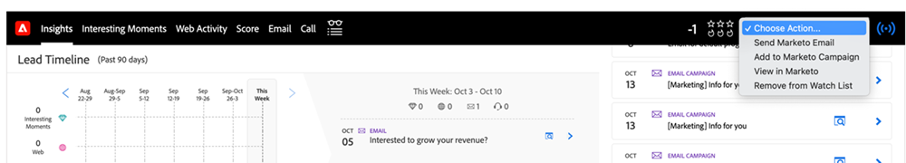
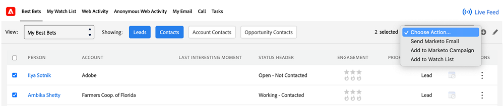

# Elegir una acción en [!DNL Sales Insight] {#choose-an-action-in-sales-insight}

Las siguientes acciones están disponibles en la lista desplegable [!DNL Sales Insight] de [!DNL Salesforce] Classic y Lightning:

* Enviar correo electrónico a Marketo
* Añadir a Marketo Campaign
* Agregar a la lista de observación

Se puede acceder a cada una de estas funciones desde:

**Diseño de página con una sola acción**

* Panel de diseño de posibles clientes: una acción y puede controlarse mediante un perfil de usuario
* Panel de diseño de contacto: una acción y puede controlarse mediante un perfil de usuario
* Botón de diseño de posible cliente: acción única y no puede ser controlada por el perfil de usuario
* Botón Diseño de contacto: acción única y no la puede controlar el perfil de usuario

  

**Diseño de página con acción de grupo**

* Panel de diseño de cuenta: acción de grupo y que el perfil de usuario puede controlar
* Panel de diseño de oportunidad: acción de grupo y puede ser controlado por el perfil de usuario

  

**[!DNL Best Bets]ficha**

* [!DNL Best Bets] pestaña Acciones masivas: Acción de grupo y puede ser controlado por el perfil de usuario

  

* [!DNL Best Bets] Pestaña Acciones en línea: una acción y puede controlarse mediante un perfil de usuario

  

**Vista de lista con acción en masa**

* Vista de lista de posibles clientes: acción masiva y el perfil de usuario no puede controlarlo
* Vista de lista de contactos: acción masiva y el perfil de usuario no puede controlarla

  
