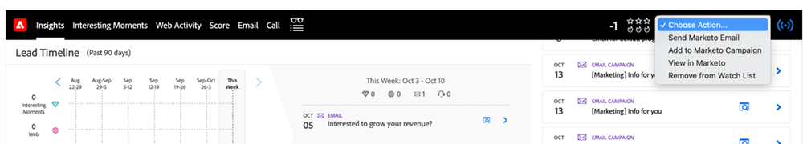

# Elegir una acción en la perspectiva de ventas {#choose-an-action-in-sales-insight}

Las siguientes acciones están disponibles en la lista desplegable Perspectiva de ventas de Salesforce Classic y Lightning:

* Enviar correo electrónico de Marketo
* Añadir a Marketo Campaign
* Agregar a la lista de observación

Se puede acceder a cada una de estas funciones desde:

**Diseño de página con una sola acción**

* Panel Diseño de posible cliente: Acción única y se puede controlar mediante el perfil de usuario
* Panel Diseño de contacto: Acción única y se puede controlar mediante el perfil de usuario
* Botón Diseño de posible cliente: Acción única y no se puede controlar mediante el perfil de usuario
* Botón Diseño de contacto: Acción única y no se puede controlar mediante el perfil de usuario

   

**Diseño de página con acción de grupo**

* Panel Diseño de la cuenta: Acción de grupo y se puede controlar mediante el perfil de usuario
* Panel de diseño de oportunidad: Acción de grupo y se puede controlar mediante el perfil de usuario

   

**Ficha Mejores apuestas**

* Pestaña Mejores acciones masivas : Acción de grupo y se puede controlar mediante el perfil de usuario

   

* Pestaña Mejores apuestas en línea: Acción única y se puede controlar mediante el perfil de usuario

   

**Vista de lista con acción masiva**

* Vista de lista de posibles clientes: Acción masiva y no se puede controlar mediante el perfil de usuario
* Vista de lista de contactos: Acción masiva y no se puede controlar mediante el perfil de usuario

   
