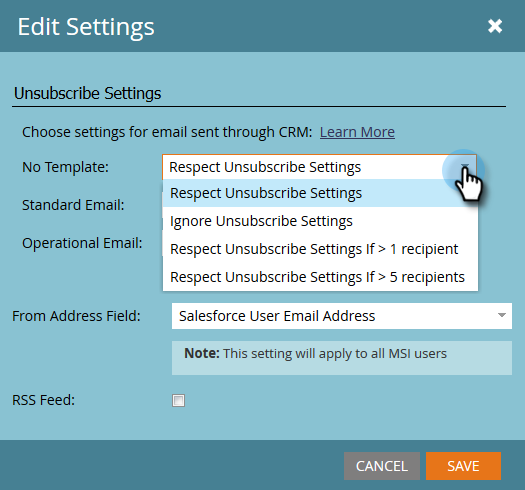

# Configurar la anulación de la suscripción de los pies de página en la perspectiva de ventas de Marketing a {#configure-unsubscribe-footers-in-marketo-sales-insight}

Los correos electrónicos de ventas colocan automáticamente el pie de página de cancelación de suscripción en la parte inferior. Sin embargo, puede ajustar la configuración para satisfacer sus necesidades.

>[!NOTE]
>
>**Se requieren permisos de administración**

>[!NOTE]
>
>**Definición**
>
>**Los** correos electrónicos de ventas son aquellos enviados desde Sales Insight (no incluyen los enviados desde el complemento de Marketing to Outlook).

1. Vaya al área **Administración**.

   

1. Haga clic en **Perspectiva de ventas** y, a continuación, **Editar configuración**.

   

   Existen varias opciones. Primero veamos los tipos de correos electrónicos para los que puede cambiar la configuración.

   

   * **Sin plantilla** : compuesta manualmente por un usuario de ventas.
   * **Correo electrónico**  estándar: correos electrónicos basados en una plantilla.
   * **Correo electrónico**  operativo: correos electrónicos que omiten los límites de comunicación, de marketing suspendido y de suscripción (se envían independientemente de qué).

   Tiene la opción de establecer un comportamiento diferente para cada tipo.

   >[!CAUTION]
   >
   >**Respetar configuración** de cancelación de suscripción: los leads no suscritos NO recibirán el correo electrónico aunque el correo electrónico publicado esté &quot;operativo&quot;
   >
   >**Ignorar configuración** de cancelación de suscripción: los leads no suscritos recibirán el correo electrónico

1. Realice los cambios que desee y haga clic en **Guardar**.

   >[!TIP]
   >
   >Las dos últimas opciones le permiten incluir o excluir dinámicamente el pie de página de cancelación de suscripción en función del número de destinatarios (Buenos a 1 o Buenos a 5).

   

¡Guau! Un poco complicado, pero bastante flexible, ¿verdad?
