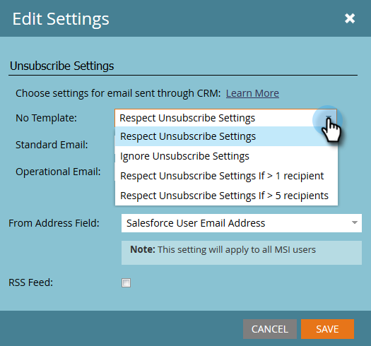

# Configurar pies de página para cancelar la suscripción en [!DNL Marketo Sales Insight] {#configure-unsubscribe-footers-in-marketo-sales-insight}

Los correos electrónicos de ventas sitúan automáticamente el pie de página de cancelación de suscripción en la parte inferior. Sin embargo, puede ajustar la configuración para satisfacer sus necesidades.

>[!NOTE]
>
>**Se requieren permisos de administrador**

>[!NOTE]
>
>**Definición**
>
>**Correos electrónicos de ventas** son los enviados desde [!DNL Sales Insight] (no incluye los enviados desde el complemento de Outlook de Marketo).

1. Vaya al área de **[!UICONTROL Admin]**.

   

1. Haga clic en **[!UICONTROL Insight de ventas]** y luego en **[!UICONTROL Editar configuración]**.

   

   Hay varias opciones. Primero vamos a echar un vistazo a los tipos de correos electrónicos para los que puede cambiar la configuración.

   

   * **[!UICONTROL Sin plantilla]** - Compuesto manualmente por el usuario de ventas.
   * **[!UICONTROL Correo electrónico estándar]**: correos electrónicos basados en una plantilla.
   * **[!UICONTROL Correo electrónico operativo]**: Correos electrónicos que omiten los límites de cancelación de suscripción, marketing suspendido y comunicaciones (se envían independientemente de qué).

   Tiene la opción de establecer un comportamiento diferente para cada tipo.

   >[!CAUTION]
   >
   >**[!UICONTROL Respetar la configuración de cancelación de suscripción]**: los posibles clientes no suscritos NO recibirán el correo electrónico aunque el correo electrónico publicado esté &quot;operativo&quot;
   >
   >**[!UICONTROL Ignorar configuración de cancelación de suscripción]**: los posibles clientes no suscritos recibirán el correo electrónico

1. Realice los cambios que desee y haga clic en **[!UICONTROL Guardar]**.

   >[!TIP]
   >
   >Las dos últimas opciones permiten incluir o excluir dinámicamente el pie de página de cancelación de suscripción en función del número de destinatarios (mayor que 1 o mayor que 5).

   

¡Uy! Un poco complicado, pero bastante flexible, ¿verdad?
