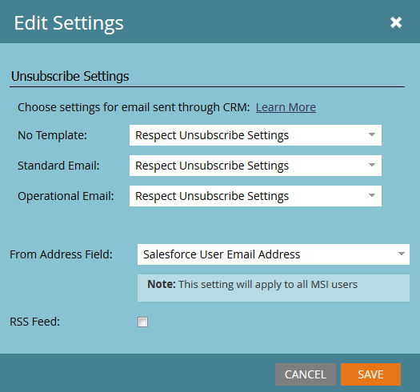

# Configuración de los pies de página para cancelar suscripción en Marketo Sales Insight {#configure-unsubscribe-footers-in-marketo-sales-insight}

Los correos electrónicos de ventas sitúan automáticamente el pie de página de cancelación de suscripción en la parte inferior. Sin embargo, puede ajustar la configuración para satisfacer sus necesidades.

>[!NOTE]
>
>**Permisos de administración necesarios**

>[!NOTE]
>
>**Definición**
>
>**Correos electrónicos de ventas** son los que se envían desde Sales Insight (no incluye los que se envían desde el complemento de Marketo Outlook).

1. Vaya a la **Administrador** área.

   

1. Clic **Perspectiva de ventas**, entonces **Editar configuración**.

   

   Hay varias opciones. Primero vamos a echar un vistazo a los tipos de correos electrónicos para los que puede cambiar la configuración.

   

   * **Sin plantilla** - Compuesto manualmente por el usuario de ventas.
   * **Correo electrónico estándar** - Correos electrónicos basados en una plantilla.
   * **Correo electrónico operativo** - Correos electrónicos que ignoran los límites de cancelación de suscripción, marketing suspendido y comunicación (envían sin importar qué).

   Tiene la opción de establecer un comportamiento diferente para cada tipo.

   >[!CAUTION]
   >
   >**Respetar configuración de cancelación de suscripción**: los posibles clientes no suscritos NO recibirán el correo electrónico aunque el correo electrónico publicado esté &quot;operativo&quot;
   >
   >**Ignorar configuración de cancelación de suscripción**: los posibles clientes no suscritos recibirán el correo electrónico

1. Realice los cambios que desee y haga clic en **Guardar**.

   >[!TIP]
   >
   >Las dos últimas opciones permiten incluir o excluir dinámicamente el pie de página de cancelación de suscripción en función del número de destinatarios (Bueno que 1 o Bueno que 5).

   

¡Uy! Un poco complicado, pero bastante flexible, ¿verdad?
