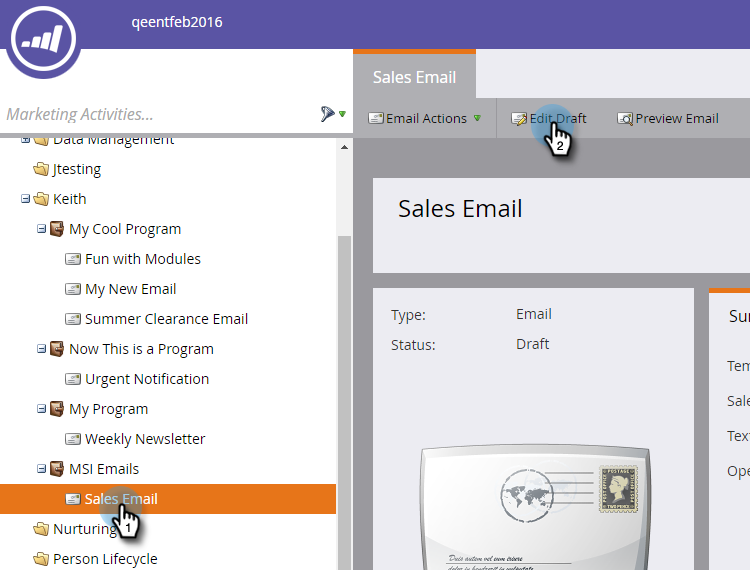

# Publicar un correo electrónico en Sales Insight {#publish-an-email-to-sales-insight}

Habilite la configuración Publicar en perspectiva de ventas para que su equipo de ventas reciba un correo electrónico tanto en perspectiva de ventas como en el complemento de Outlook y Gmail. También puede darle una fecha de caducidad.

1. Busque el correo electrónico, selecciónelo y haga clic en **Editar borrador**.

   

1. Una vez abierto el editor, haga clic en **Configuración de correo electrónico**.

   

1. Marque **Publicar en Marketo Sales Insight**.

   

1. Para establecer una fecha de caducidad (opcional), marque **Definir caducidad** y elija una fecha.

   

   >[!NOTE]
   >
   >A las 23:59 (CST) del día de caducidad (si establece una), el correo electrónico que puso a disposición desaparecerá de Sales Insight y de cualquiera de sus complementos. Por supuesto, seguirá siendo accesible en Marketo.

1. Clic **Guardar**.

   

¡Buen trabajo! Ahora sabe cómo poner correos electrónicos disponibles para que su equipo de ventas envíe en el lado del CRM y limitar su tiempo disponible, si es necesario.

>[!NOTE]
>
>[Mis tokens](/help/marketo/product-docs/core-marketo-concepts/programs/tokens/understanding-my-tokens-in-a-program.md) no se resolverá al enviar un correo electrónico desde la perspectiva de ventas en Microsoft Dynamics o Salesforce; solo se rellenarán los tokens estándar (posible cliente, compañía, etc.). Sin embargo, los valores predeterminados para los tokens funcionarán.

>[!TIP]
>
>No olvide aprobar este correo electrónico para que los cambios surtan efecto. Obtenga información sobre cómo [Aprobar un correo electrónico](/help/marketo/product-docs/email-marketing/general/creating-an-email/approve-an-email.md).
