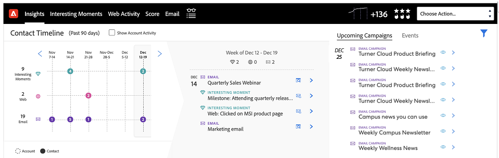

# Información general sobre las funciones del panel de control de Insights {#insights-dashboard-feature-overview}

Obtenga más información acerca de las características disponibles en su panel de [!DNL Sales Insights].

>[!PREREQUISITES]
>
>Debe tener el paquete MSI SFDC más reciente y [configuración](/help/marketo/product-docs/marketo-sales-insight/msi-for-salesforce/configuration/configuration-for-existing-customers.md).

## Diseño de contacto {#contact-layout}

**Cuadrícula de velocidad de interacción**

* Esta cuadrícula inteligente incluye momentos interesantes, correo electrónico y actividad web en los últimos 90 días
* El usuario puede elegir la actividad &quot;[!UICONTROL Mostrar cuenta]&quot;, que clasificará en niveles todos los momentos interesantes, el correo electrónico y la actividad web de la cuenta en la vista de contacto
* El usuario puede resaltar una semana específica para ver las actividades dentro de esa semana
* Vista predeterminada: La semana actual está seleccionada

**Desglose y resumen de la participación**

* Explorar en profundidad las tarjetas de actividad para momentos interesantes, correo electrónico y actividad web
* Tarjeta de actividad Momentos interesantes: incluye la opción Suscribirse
* Tarjeta de actividad de correo electrónico: incluye opción de previsualización
* Tarjeta de actividad web: incluye la posibilidad de hacer clic en un vínculo
* La barra de resumen semanal mostrará momentos interesantes, correo electrónico y actividad web para esa semana. Se puede hacer clic en cada icono y utilizarlo como filtro para mostrar una actividad específica
* Vista predeterminada: Esta es una lista de actividades de la vista actual

**Próximas campañas y eventos de correo electrónico**

Pestaña Campañas de correo electrónico:

* Incluye campañas que forman parte de programas de correo electrónico o programas predeterminados programados en los próximos 90 días
* No específico del contacto/posible cliente (es decir, la lista de campañas es una lista genérica de todas las campañas de correo electrónico programadas en la instancia de Marketo). La lista de campañas en todos los paneles de posible cliente, contacto, cuenta y oportunidad será la misma
* Si la periodicidad de la campaña es tal que se ejecuta más de tres veces en los próximos 90 días, solo se mostrarán las tres ejecuciones siguientes en un momento determinado (similar al comportamiento en Marketo)
* La tarjeta de detalles de actividad de esta sección tendrá una opción de vista previa. Si el flujo incluye varios pasos para enviar correo electrónico, todos los correos electrónicos estarán disponibles para su previsualización. Dentro del paso de flujo de envío de correo electrónico, si hay varias &quot;opciones de correo electrónico&quot;, la opción predeterminada estará disponible para la vista previa
* Los filtros incluyen &quot;[!UICONTROL Buscar]&quot; y &quot;[!UICONTROL Intervalo de fechas]&quot;

Pestaña Evento:

* Incluye programas de eventos programados en los próximos 90 días
* Utilice la opción de filtro para ver todos los eventos/eventos invitados (según la configuración de la administración)
* Al seleccionar eventos invitados, se mostrarán los eventos a los que se ha invitado a un contacto específico, junto con el estado de miembro
* Al seleccionar todos los eventos, se mostrará una lista de los eventos programados en los próximos 90 días
* La tarjeta Detalles de actividad de esta sección tiene una opción de vista previa
* El filtro incluye &quot;[!UICONTROL Buscar]&quot;, &quot;[!UICONTROL Mostrar solo eventos invitados]&quot; y &quot;[!UICONTROL Intervalo de fechas]&quot;

## Diseño de posible cliente {#lead-layout}

**Cuadrícula de velocidad de interacción**

* Esta cuadrícula inteligente incluye momentos interesantes, correo electrónico y actividad web en los últimos 90 días
* El usuario puede resaltar una semana específica para ver las actividades dentro de esa semana
* Vista predeterminada: La semana actual está seleccionada
* La característica &quot;[!UICONTROL Mostrar actividad de cuenta]&quot; no está disponible en los posibles clientes, ya que no forma parte de ninguna cuenta de [!DNL Salesforce] hasta que se convierta en contacto

**Desglose y resumen de la participación**

* Desglose de tarjetas de actividad para momentos interesantes, correo electrónico y actividad web
* Tarjeta de actividad Momentos interesantes: incluye la opción Suscribirse
* Tarjeta de actividad de correo electrónico: incluye opción de previsualización
* Tarjeta de actividad web: incluye la posibilidad de hacer clic en un vínculo
* La barra de resumen semanal mostrará momentos interesantes, correo electrónico y actividad web para esa semana. Se puede hacer clic en cada icono y utilizarlo como filtro para mostrar una actividad específica
* Vista predeterminada: Esta es una lista de actividades de la vista actual

**Próximas campañas y eventos de correo electrónico:**

Pestaña Campañas de correo electrónico:

* Incluye campañas que forman parte de programas de correo electrónico o programas predeterminados programados en los próximos 90 días
* No específico del contacto/posible cliente (es decir, la lista de campañas es una lista genérica de todas las campañas de correo electrónico programadas en la instancia de Marketo). La lista de campañas en todos los paneles de posible cliente, contacto, cuenta y oportunidad será la misma
* Si la periodicidad de la campaña es tal que se ejecuta más de tres veces en los próximos 90 días, solo se mostrarán las tres ejecuciones siguientes en un momento determinado (similar al comportamiento en Marketo)
* La tarjeta de detalles de actividad de esta sección tendrá una opción de vista previa. Si el flujo incluye varios pasos para enviar correo electrónico, todos los correos electrónicos estarán disponibles para su previsualización. Dentro del paso de flujo de envío de correo electrónico, si hay varias &quot;opciones de correo electrónico&quot;, la opción predeterminada estará disponible para la vista previa
* Los filtros incluyen &quot;[!UICONTROL Buscar]&quot; y &quot;[!UICONTROL Intervalo de fechas]&quot;

Pestaña Evento:

* Incluye programas de eventos programados en los próximos 90 días
* Utilice la opción de filtro para ver todos los eventos/eventos invitados (según la configuración de la administración)
* Al seleccionar eventos invitados, se mostrarán los eventos a los que se ha invitado a un contacto específico, junto con el estado de miembro
* Al seleccionar todos los eventos, se mostrará una lista de los eventos programados en los próximos 90 días
* La tarjeta Detalles de actividad de esta sección tiene una opción de vista previa
* El filtro incluye &quot;[!UICONTROL Buscar]&quot;, &quot;[!UICONTROL Mostrar solo eventos invitados]&quot; y &quot;[!UICONTROL Intervalo de fechas]&quot;

## Diseño de cuenta {#account-layout}

**Cuadrícula de velocidad de interacción**

* Esta cuadrícula inteligente incluye momentos interesantes, correo electrónico y actividad web en los últimos 90 días para todos los contactos de la cuenta
* El usuario puede resaltar una semana específica para ver las actividades dentro de esa semana
* Vista predeterminada: La semana actual está seleccionada

**Desglose y resumen de la participación**

* Desglose de tarjetas de actividad para momentos interesantes, correo electrónico y actividad web, incluido el nombre del contacto
* Tarjeta de actividad Momentos interesantes: incluye la opción Suscribirse
* Tarjeta de actividad de correo electrónico: incluye opción de previsualización
* Tarjeta de actividad web: incluye la posibilidad de hacer clic en un vínculo
* La barra de resumen semanal mostrará momentos interesantes, correo electrónico y actividad web para esa semana. Se puede hacer clic en cada icono y utilizarlo como filtro para mostrar una actividad específica
* Vista predeterminada: Esta es una lista de actividades de la vista actual

**Próximas campañas y eventos de correo electrónico**

Pestaña Campañas de correo electrónico:

* Incluye campañas que forman parte de programas de correo electrónico o programas predeterminados programados en los próximos 90 días
* No específico del contacto/posible cliente (es decir, la lista de campañas es una lista genérica de todas las campañas de correo electrónico programadas en la instancia de Marketo). La lista de campañas en todos los paneles de posible cliente, contacto, cuenta y oportunidad será la misma
* Si la periodicidad de la campaña es tal que se ejecuta más de tres veces en los próximos 90 días, solo se mostrarán las tres ejecuciones siguientes en un momento determinado (similar al comportamiento en Marketo)
* La tarjeta de detalles de actividad de esta sección tendrá una opción de vista previa. Si el flujo incluye varios pasos para enviar correo electrónico, todos los correos electrónicos estarán disponibles para su previsualización. Dentro del paso de flujo de envío de correo electrónico, si hay varias &quot;opciones de correo electrónico&quot;, la opción predeterminada estará disponible para la vista previa
* Los filtros incluyen &quot;[!UICONTROL Buscar]&quot; y &quot;[!UICONTROL Intervalo de fechas]&quot;

Pestaña Evento:

* Incluye programas de eventos programados en los próximos 90 días
* Utilice la opción de filtro para ver todos los eventos/eventos invitados (según la configuración de la administración)
* Al seleccionar eventos invitados, se mostrarán los eventos a los que se ha invitado a un contacto específico, junto con el estado de miembro
* Al seleccionar todos los eventos, se mostrará una lista de los eventos programados en los próximos 90 días
* La tarjeta Detalles de actividad de esta sección tiene una opción de vista previa
* El filtro incluye &quot;[!UICONTROL Buscar]&quot;, &quot;[!UICONTROL Mostrar solo eventos invitados]&quot; y &quot;[!UICONTROL Intervalo de fechas]&quot;

## Diseño de oportunidad {#opportunity-layout}

**Cuadrícula de velocidad de interacción**

* Esta cuadrícula inteligente incluye momentos interesantes, correo electrónico y actividad web en los últimos 90 días para todos los contactos de la oportunidad
* El usuario puede resaltar una semana específica para ver las actividades dentro de esa semana
* Vista predeterminada: La semana actual está seleccionada

**Desglose y resumen de la participación**

* Desglose de tarjetas de actividad para momentos interesantes, correo electrónico y actividad web, incluido el nombre del contacto
* Tarjeta de actividad Momentos interesantes: incluye la opción Suscribirse
* Tarjeta de actividad de correo electrónico: incluye opción de previsualización
* Tarjeta de actividad web: incluye la posibilidad de hacer clic en un vínculo
* La barra de resumen semanal mostrará momentos interesantes, correo electrónico y actividad web para esa semana. Se puede hacer clic en cada icono y utilizarlo como filtro para mostrar una actividad específica
* Vista predeterminada: Esta es una lista de actividades de la vista actual

**Próximas campañas y eventos de correo electrónico** pestaña Campañas de correo electrónico:

* Incluye campañas que forman parte de programas de correo electrónico o programas predeterminados programados en los próximos 90 días
* No específico del contacto/posible cliente (es decir, la lista de campañas es una lista genérica de todas las campañas de correo electrónico programadas en la instancia de Marketo). La lista de campañas en todos los paneles de posible cliente, contacto, cuenta y oportunidad será la misma
* Si la periodicidad de la campaña es tal que se ejecuta más de tres veces en los próximos 90 días, solo se mostrarán las tres ejecuciones siguientes en un momento determinado (similar al comportamiento en Marketo)
* La tarjeta de detalles de actividad de esta sección tendrá una opción de vista previa. Si el flujo incluye varios pasos para enviar correo electrónico, todos los correos electrónicos estarán disponibles para su previsualización. Dentro del paso de flujo de envío de correo electrónico, si hay varias &quot;opciones de correo electrónico&quot;, la opción predeterminada estará disponible para la vista previa
* Los filtros incluyen &quot;[!UICONTROL Buscar]&quot; y &quot;[!UICONTROL Intervalo de fechas]&quot;

Pestaña Evento:

* Incluye programas de eventos programados en los próximos 90 días
* Utilice la opción de filtro para ver todos los eventos/eventos invitados (según la configuración de la administración)
* Al seleccionar eventos invitados, se mostrarán los eventos a los que se ha invitado a un contacto específico, junto con el estado de miembro
* Al seleccionar todos los eventos, se mostrará una lista de los eventos programados en los próximos 90 días
* La tarjeta Detalles de actividad de esta sección tiene una opción de vista previa
* El filtro incluye &quot;[!UICONTROL Buscar]&quot;, &quot;[!UICONTROL Mostrar solo eventos invitados]&quot; y &quot;[!UICONTROL Intervalo de fechas]&quot;

>[!NOTE]
>
>Si su cuenta u oportunidad tiene más de 800 contactos, el panel no mostrará ningún dato. Sin embargo, puede ir a contactos individuales para ver sus perspectivas y participación. Si tu cuenta tiene más de 800 contactos, se deshabilitará &quot;[!UICONTROL Mostrar actividad de nivel de cuenta]&quot;.
