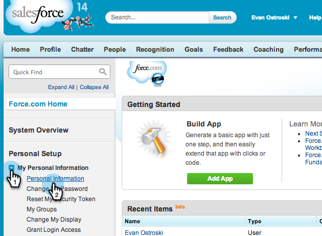
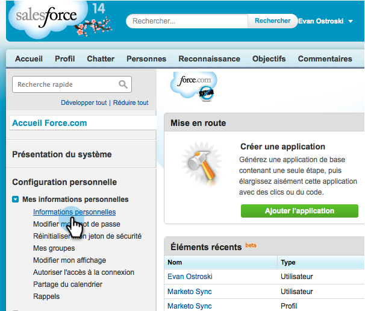

# Preparar la perspectiva de ventas para el soporte multilingüe en Salesforce {#prepare-sales-insight-for-multi-lingual-support-in-salesforce}

>[!NOTE]
>
>**Se requieren permisos de administrador**

Marketo Sales Insight se almacena por idioma. Por lo tanto, si desea que funcione para más de un idioma, debe introducir las credenciales por separado para cada idioma.

>[!NOTE]
>
>La perspectiva de ventas admite actualmente:
>
>* Inglés
>* Francés
>* Alemán
>
>Cualquier otro idioma usa el inglés de forma predeterminada.

## Adición de un nuevo idioma para la perspectiva de ventas de Marketo {#adding-a-new-language-for-marketo-sales-insight}

1. Inicie sesión en Salesforce. En la lista desplegable debajo de su nombre en la esquina superior derecha, haga clic en **Configuración**.

   

1. En **Mi información personal**, haga clic en **Información personal**.

   

1. Haga clic en **Editar**.

   

1. Seleccione un idioma y haga clic en **Guardar**.

   

1. La interfaz de Salesforce ahora está en el idioma seleccionado. Puede hacer clic en el botón **+** para ver todas las pestañas disponibles.

   

1. Haga clic en **Configurar la perspectiva de ventas de Marketo** (en el idioma seleccionado).

   

1. Vaya a Marketo. Busque su [Perspectiva de ventas de Marketo **Configuración de API** detalles](/help/marketo/product-docs/marketo-sales-insight/msi-for-salesforce/configuration/configure-marketo-sales-insight-in-salesforce-enterprise-unlimited.md#configure-marketo-sales-insight).

   

1. Introduzca los detalles de la API en Marketo y haga clic en **Guardar**.

   

## Volver a cambiar Salesforce a inglés {#change-salesforce-back-to-english}

Cuando haya terminado de personalizar su organización de Salesforce, le explicamos cómo devolver su configuración personal al inglés.

>[!NOTE]
>
>Las siguientes capturas de pantalla están en francés con instrucciones en inglés.  Verá las mismas pantallas con texto en el idioma seleccionado en el paso anterior.

1. Bajo su nombre, haga clic en **Configuración**.

1. Haga clic en **Información personal** under **Mi información personal**.

   

1. Haga clic en **Editar**.

   

1. Select **Inglés** en la lista desplegable Idioma y haga clic en **Guardar**.

   

   ¡Ahora tu Salesforce está de vuelta en inglés!
