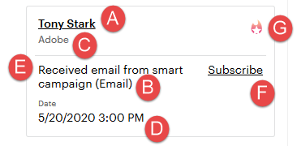

# Uso de la fuente de posibles clientes {#using-the-lead-feed}

La fuente de posibles clientes es una lista actualizada de eventos interesantes realizados por sus posibles clientes. Lo encontrará en el lado derecho al hacer clic en la pestaña Marketo . Es como una fuente RSS o Twitter - las actualizaciones más recientes están en la parte superior de la lista. Utilice esto para saltar a los posibles clientes mientras sigue fresco en sus mentes.

>[!NOTE]
>
>La fuente de posibles clientes incluye tanto los posibles clientes que posee como los posibles clientes de la lista de observación.

## ¿Qué hay en la fuente de posibles clientes? {#whats-in-the-lead-feed}

Cada elemento de la fuente de posibles clientes es un momento interesante: una actividad o evento notable en el historial de marketing de este posible cliente.

Al visualizarlo en Salesforce, cada elemento tiene:

<table> 
 <colgroup> 
  <col> 
  <col> 
 </colgroup> 
 <tbody> 
  <tr> 
   <td>
Elemento
</td> 
   <td>
Descripción
</td> 
  </tr> 
  <tr> 
   <td>
A. Posible cliente/contacto
</td> 
   <td>
Persona que tuvo este momento interesante
</td> 
  </tr> 
  <tr> 
   <td>
B. Tipo de evento
</td> 
   <td>
Categoría para este momento: web, correo electrónico o hito
</td> 
  </tr> 
  <tr> 
   <td>
C. Nombre de la cuenta
</td> 
   <td>
Nombre de la empresa
</td> 
  </tr> 
  <tr> 
   <td>
D. Tiempo
</td> 
   <td>
Cuando ocurrió este momento interesante
</td> 
  </tr> 
  <tr> 
   <td>
E. Descripción del evento
</td> 
   <td>
Razón de este interesante momento
</td> 
  </tr> 
  <tr> 
   <td>
F. Suscribirse
</td> 
   <td>
Recibir notificaciones por correo electrónico para eventos como este
</td> 
  </tr> 
  <tr> 
   <td>
G. Estrella
</td> 
   <td>
Esta persona es la mejor apuesta (prioridad alta)
</td> 
  </tr> 
 </tbody> 
</table>

## Obtención de actualizaciones RSS {#getting-rss-updates}

También puede obtener actualizaciones de fuentes de posibles clientes en la fuente RSS.  Una fuente RSS le permite recibir actualizaciones de sus posibles clientes aunque no esté conectado a Salesforce. La fuente tiene la misma información que la Fuente de posibles clientes de Salesforce, así como lo siguiente (cuando está disponible):

* dirección de correo electrónico
* número de teléfono
* número de móvil
* número de fax
* dirección de la empresa
* URL de la empresa

>[!NOTE]
>
>El administrador de Marketo de su empresa debe [habilitar fuentes RSS](/help/marketo/product-docs/marketo-sales-insight/msi-for-salesforce/features/msi-configuration-tab/enable-rss-for-sales-insight.md) para que esto funcione.

Para obtener actualizaciones RSS, necesitará dos cosas: el vínculo RSS y un lector de fuentes RSS. Para obtener el vínculo RSS, haga clic en el icono RSS de la fuente de posibles clientes:

La fuente RSS aparecerá en una nueva ventana. A continuación, puede copiar la URL de su fuente RSS y utilizarla en un lector RSS. La mayoría de los exploradores tienen un lector RSS incorporado, o puede utilizar un lector RSS específico de su plataforma.
