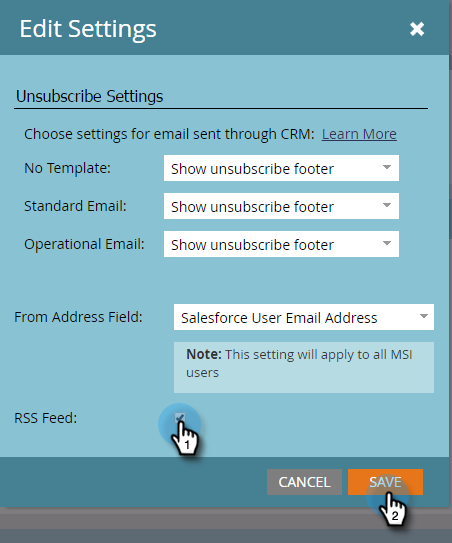

# Habilitar RSS para perspectiva de ventas {#enable-rss-for-sales-insight}

>[!NOTE]
>
>**Se requieren permisos de administración**

Si los usuarios de Marketing to desean vista de su fuente de posibles clientes no solo en Salesforce, sino también en una fuente RSS, un administrador de marketing debe activarla primero. Es fácil.

1. En Mi marketing, haga clic en **Administración** y luego en **Perspectiva de ventas**.

   

1. En Configuración, haga clic en **Editar**. Tenga en cuenta que la fuente RSS se muestra como **Deshabilitada**.

   

1. En el cuadro de diálogo Editar configuración, marque la casilla **fuente RSS** y haga clic en **Guardar**.

   

   La fuente RSS ahora se muestra como **Habilitada**.

   

   ¡Un pedazo de torta!
