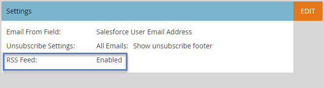

# Habilitar RSS para la perspectiva de ventas {#enable-rss-for-sales-insight}

>[!NOTE]
>
>**Se requieren permisos de administrador**

Si los usuarios de Marketo desean ver su fuente principal no solo en Salesforce, sino también en una fuente RSS, un administrador de Marketo debe habilitarla primero. Es fácil.

1. En Mi Marketo, haga clic en **Administrador** y luego **Perspectiva de ventas**.

   

1. En Configuración, haga clic en **Editar**. Tenga en cuenta que la fuente RSS se muestra como **Desactivado**.

   

1. En el cuadro de diálogo Editar configuración, marque la casilla **Fuente RSS** casilla de verificación y haga clic en **Guardar**.

   

   La fuente RSS ahora se muestra como **Habilitado**.

   

   ¡Un trozo de tarta!
