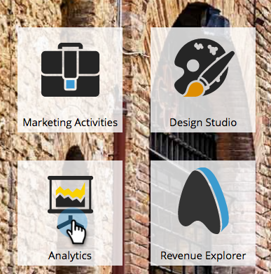

# Informe de rendimiento de correo electrónico de Sales Insight {#sales-insight-email-performance-report}

Ver el rendimiento de los mensajes de correo electrónico enviados a través de [!DNL Salesforce], [!DNL Microsoft Dynamics] o un complemento de Gmail o [!DNL Outlook].

## Generar un informe {#generate-a-report}

1. Haga clic en **[!UICONTROL Analytics]**.

   

1. Haga clic en **[!UICONTROL Rendimiento de correo electrónico de Sales Insight]**.

   

1. Haga clic en la ficha **[!UICONTROL Configuración]** y elija los valores que desee.

   

1. Haga clic en la ficha **[!UICONTROL Informe]**.

   

   ¡Excelente! Ahora puede ver el rendimiento de los correos electrónicos enviados desde su equipo de ventas.

   >[!NOTE]
   >
   >El estado de entrega no se captura para los correos electrónicos enviados mediante Sales Insight y no se incluye en este informe ni en los registros de actividad.

>[!TIP]
>
>Haga clic en el nombre de un correo electrónico para abrirlo en el previsualizador de correo electrónico.

## Agrupar por [!UICONTROL representante de ventas] {#group-by-sales-rep}

Puede ver este informe agrupado por representante de ventas cambiando la configuración.

1. Haga clic en **[!UICONTROL Configuración]**. Haga doble clic en **[!UICONTROL Correo electrónico]**.

   

1. Seleccionar correos electrónicos de grupo por **[!UICONTROL representante de ventas]**.

   

1. Haga clic en **[!UICONTROL Guardar]**.

   

1. Haga clic en la ficha **[!UICONTROL Informe]**.

   

   Bastante genial, ¿eh? Ahora puede ver el rendimiento de los correos electrónicos agrupados por representante de ventas.
