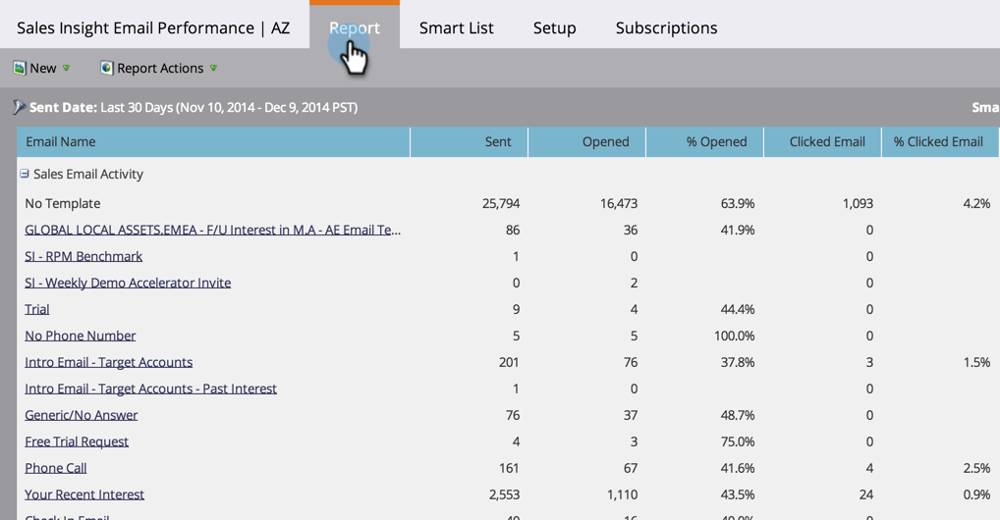

# Informe de rendimiento de correo electrónico de Sales Insight {#sales-insight-email-performance-report}

Vea el rendimiento de los correos electrónicos enviados a través de Salesforce, Microsoft Dynamics o un complemento de Gmail o Outlook.

## Generar un informe {#generate-a-report}

1. Clic **Analytics**.

   

1. Clic **Rendimiento de correo electrónico de Sales Insight**.

   

1. Haga clic en **Configurar** y elija los valores que desee.

   

1. Haga clic en **Informe** pestaña.

   

   Excelente! Ahora puede ver el rendimiento de los correos electrónicos enviados desde su equipo de ventas.

   >[!NOTE]
   >
   >El estado de entrega no se captura para los correos electrónicos enviados mediante Sales Insight y no se incluye en este informe ni en los registros de actividad.

>[!TIP]
>
>Haga clic en el nombre de un correo electrónico para abrirlo en el previsualizador de correo electrónico.

## Agrupar por representante de ventas {#group-by-sales-rep}

Puede ver este informe agrupado por representante de ventas cambiando la configuración.

1. Clic **Configurar**. Doble clic **Correo electrónico**.

   

1. Seleccionar correos electrónicos de grupo por **Representante de ventas**.

   

1. Clic **Guardar**.

   

1. Haga clic en **Informe** pestaña.

   

   Bastante genial, ¿eh? Ahora puede ver el rendimiento de los correos electrónicos agrupados por representante de ventas.
