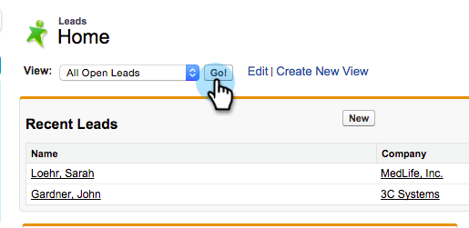

# Enviar un correo electrónico a varios registros en Marketo Sales Insight {#send-an-email-to-multiple-records-in-marketo-sales-insight}

Es muy fácil enviar un correo electrónico de Marketo a varias personas mediante Marketo Sales Insight. Empecemos.

1. En Salesforce, haga clic en **Posibles clientes** o **Contactos**.

   

1. Haga clic en **Ir** para ver todos los posibles clientes abiertos.

   

1. En la vista de lista, compruebe todos los posibles clientes o contactos a los que desee enviar el correo electrónico y haga clic en **Enviar correo electrónico de Marketo (clásico)**.

   

   >[!NOTE]
   >
   >Si utiliza Salesforce Lightning, el botón dirá **Enviar correo electrónico de Marketo (relámpago)**.

   >[!TIP]
   >
   >¿No ves el botón? Asegúrese de que [se han añadido los botones de Marketo a la vista de lista](/help/marketo/product-docs/marketo-sales-insight/msi-for-salesforce/configuration/add-bulk-action-buttons-to-salesforce-classic.md).

1. Adelante y redacte su correo electrónico. Haga clic en **Enviar con Marketo** cuando termine.

   

   >[!TIP]
   >
   >Puede [publicar correo electrónico en Sales Insight](/help/marketo/product-docs/marketo-sales-insight/msi-for-salesforce/features/actions-in-the-msi-panel/send-marketo-email/publish-an-email-to-sales-insight.md) y elija entre esos correos electrónicos.

   >[!NOTE]
   >
   >Puede enviar hasta 200 correos electrónicos de Marketo a la vez.
