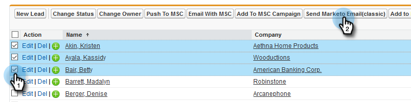

# Enviar un correo electrónico a varios registros en [!DNL Marketo Sales Insight] {#send-an-email-to-multiple-records-in-marketo-sales-insight}

Es muy fácil enviar un correo electrónico de Marketo a varias personas usando [!DNL Marketo Sales Insight]. Vamos a empezar...

1. En [!DNL Salesforce], haga clic en **[!UICONTROL Posibles clientes]** o en **[!UICONTROL Contactos]**.

   

1. Haga clic en **[!UICONTROL Ir]** para ver todos los posibles clientes abiertos.

   

1. En la vista de lista, compruebe todos los posibles clientes o contactos a los que desee enviar un correo electrónico y haga clic en **[!UICONTROL Enviar correo electrónico de Marketo (clásico)]**.

   

   >[!NOTE]
   >
   >Si estás usando [!DNL Salesforce Lightning], el botón dirá **[!UICONTROL Enviar correo electrónico de Marketo (relámpago)]**.

   >[!TIP]
   >
   >¿No ves el botón? Asegúrese de haber [agregado los botones de Marketo a la vista de lista](/help/marketo/product-docs/marketo-sales-insight/msi-for-salesforce/configuration/add-bulk-action-buttons-to-salesforce-classic.md).

1. Continúe y redacte el correo electrónico. Haga clic en **[!UICONTROL Enviar con Marketo]** cuando termine.

   

   >[!TIP]
   >
   >Puede [publicar correo electrónico en [!DNL Sales Insight]](/help/marketo/product-docs/marketo-sales-insight/msi-for-salesforce/features/actions-in-the-msi-panel/send-marketo-email/publish-an-email-to-sales-insight.md) y elegir entre esos mensajes.

   >[!NOTE]
   >
   >Puede enviar hasta 200 correos electrónicos de Marketo a la vez.
